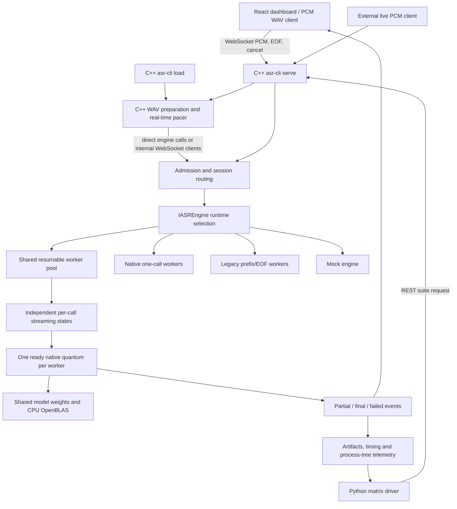

# Architecture and code map

This document describes the implemented **`qwen_stream` resumable CPU runtime**. [report.md](../report.md) is the canonical source for measured results, design evaluation and conditional sizing. Native and prefix runtimes remain available as distinct configurations.

## 1. End-to-end flow

Inference and WAV reading/pacing are C/C++. Python starts services, submits suites, scores saved transcripts and produces reports; it does not infer the model or send every PCM chunk. The model is Qwen3-ASR-0.6B, implemented through pinned `antirez/qwen-asr` CPU C kernels and OpenBLAS. `llama.cpp` and `whisper.cpp` are not runtime dependencies.

## 2. Workers, sessions and model ownership

A **session** is one independently streamed call leg. A **worker** owns one loaded model weight set and executes one inference job at a time. Several sessions can retain state on one worker without computing simultaneously.

| Resource | Ownership in `qwen_stream` |
|---|---|
| Immutable model weights | Loaded once per worker; borrowed by all its session states |
| Encoder window cache and mutable scratch | Private per call |
| Decoder KV/prefill buffers, token history and language prompt | Private per call |
| PCM, audio cursor, identity, revisions and deadlines | Private per call |
| Ready-step queue and compute budget | Per worker |
| Routing, service status and result coordination | Service/controller |

One worker is hosted inside the service process. Two or more workers use persistent `asr-prefix-worker` helper processes plus the coordinating service process. The executable/class names retain the shared engine's original naming; capabilities identify the selected runtime:

- One worker: `qwen_stream_shared`.
- Process pool: `qwen_stream_process_pool`.
- Streaming behavior: `resumable_windowed_streaming`.

The existing `PrefixMultiplexEngine` and `PrefixProcessPool` implement both shared modes, selected by `SharedStreamOptions`. Reusing those components preserves admission, IPC, cancellation and observability interfaces. Calls remain on their admitted worker because mutable streaming caches have worker-local ownership.

With **two workers/two sessions each**, four calls can receive PCM simultaneously, while at most two native decode jobs run concurrently. Four compute threads are configured per worker, giving eight model compute threads across two workers. Processes, sessions, threads and CPU core equivalents are different quantities.

## 3. Resumable state and decode lifecycle

`scripts/prepare_qwen_guard.py` invokes `scripts/prepare_qwen_stream.py` to generate guarded CPU build sources. The native vendor source remains unchanged. The generated API provides `qwen_resumable_create`, `step`, `text`, cursor/counter access and `destroy`.

1. Session admission allocates call metadata and PCM ownership; native streaming state is created for its decoding work.
2. PCM arrives progressively. A call becomes ready when enough new audio exists for its configured decode step, or when EOF requires draining.
3. The worker selects one ready call and invokes at most one native streaming quantum.
4. The call preserves its cursor, encoder-window cache, decoder prefill/KV, token history and accumulated text.
5. The worker publishes a provisional text snapshot when available, then requeues a call that still has work behind already-ready calls.
6. EOF drains remaining audio steps and produces final text. Cancellation and failures terminate the session explicitly.

Completed encoder windows and unchanged decoder prefills are reused. A growing partial encoder window can be recomputed. This is **resumable windowed streaming**, not a strictly incremental encoder or tensor batching. Passing cumulative PCM to the step API does not invoke the legacy full-prefix offline transcription operation. The wrapper currently copies a bounded cumulative PCM snapshot into a job; this remains a possible allocation/copy optimization.

Borrowed model weights outlive all call states. Destruction frees private caches/buffers without freeing the borrowed model. Published text is validated as UTF-8; incomplete trailing token bytes are withheld until complete, and invalid final text fails explicitly.

## 4. Routing and scheduling decisions

- **Least-active admission:** new calls use healthy workers with fewer admitted sessions, spreading work before sharing. Round-robin is an alternative configuration.
- **Session affinity:** call state remains on the worker selected at admission.
- **One quantum per turn:** each worker computes serially while preserving several call states.
- **Oldest-ready order:** all resumable steps use the same readiness class. A progressed call is reinserted after already-waiting calls.
- **Expiry first:** idle/total-deadline expiry is handled before expensive decode work.
- **Bounded admission:** configured session slots are checked; additional callers can be rejected rather than buffered indefinitely.
- **No kernel preemption:** scheduling changes the next job; it cannot interrupt a matrix kernel already running.

EOF does not automatically receive the legacy decoder's separate full-audio-refinement priority in the measured resumable preset. Its remaining steps share the step scheduler. The legacy rule allowing two previews to bypass a waiting EOF job applies only to `qwen_prefix`.

The final experiment measured one worker with 1–8 total calls and two workers with 2/4/8/16 total calls. At two workers/sixteen calls there are eight sessions per worker. More session slots add queued work and mutable state, not compute capacity. Only one-/two-worker host layouts were evaluated; the implementation limit is eight workers and eight sessions per worker.

## 5. Media timing, jitter and backpressure

The baseline is 16 kHz mono PCM16. The C++ preparation path records input/output format and any resampling; the browser uses baseline PCM. A 200 ms transport chunk contains 3,200 samples / 6,400 bytes. The default **2,000 ms decode step** is independent of transport chunk size.

Absolute monotonic readiness deadlines preserve the media clock. The measured delivery settings are 5 ms late tolerance, 1,000 ms maximum lag and queue caps of eight chunks / 1,000 ms / 32,000 bytes. All caps apply; time/byte limits hold approximately five full 200 ms chunks. Queue overflow or excess delivery lag fails explicitly instead of silently dropping speech.

Local delivery lag is `sent_ns − scheduled_ready_ns`. Decode queue waiting is readiness-to-model-start delay. Neither is an isolated measurement of network transit jitter. The loopback WebSocket tests do not establish WAN loss/reordering tolerance. Production RTP/provider ingress needs timestamped packet handling, a bounded jitter buffer, codec-specific concealment and explicit discontinuity telemetry.

## 6. Runtime configuration comparison

| Mode | State and scheduling | Output / finalization |
|---|---|---|
| **`qwen_stream`** | Shared weights, independent resumable call state; ready quantum then requeue | Repeated provisional revisions; EOF drains steps; optional whole-audio refinement |
| `qwen_prefix` | One persistent mutable context per worker; independent call buffers; serial prefix/final invocations | Default one 4-second preview, then full-audio EOF refinement; bounded preview/EOF priority |
| `qwen_native` | Native child/context handles one active call per occupied worker | Native progressive decoder and EOF behavior; separate process supervision |
| `mock` | Synthetic output without model inference | Integration/contract testing only |

The measured `configs/qwen_stream_shared.yaml` preset uses four threads/worker, 2-second steps, 32 maximum new tokens/step, zero initially withheld chunks and `refine_final=false`. The native runtime's initial withholding differs; first-text comparisons require matched settings. No whole-audio final refinement was used in the full resumable matrix.

Per-call `decode_step_ms` can override supported native/resumable step intervals within validated bounds. Legacy `prefix_preview_ms` controls a different operation. Model weights, worker layout and thread budgets persist for the running service and cannot be treated as arbitrary per-call model changes.

## 7. Protocol, UI and service APIs

Live WebSocket ingress is `/v1/asr`; observation is `/v1/observe`. Calls carry identity, ordered sequences and sample watermarks. Protocol states include readiness, PCM chunks, acknowledgements, EOF, cancellation and transcript revisions/terminal outcomes. Partial text is provisional rather than stable word alignment.

The React dashboard provides WAV/language selection, start/stop/reset, stream state, chunk/decode controls, first-text arrival, EOF-to-final arrival and optional reference WER/CER. Older observer revisions cannot overwrite a newer/final transcript. Browser arrival and server publication timestamps are measured separately.

REST routes include `/v1/capabilities`, `/v1/config/resolve`, `/v1/runtime`, `/v1/suites/dry-run`, `/v1/suites`, `/v1/jobs`, `/v1/jobs/{id}`, `/v1/jobs/{id}/stop`, `/v1/history` and allowlisted `/v1/artifacts/{id}/{file}`. REST suites invoke the same C++ WAV simulator. Direct mode calls the engine; network mode uses internal C++ WebSocket clients. External callers can stream PCM without the Python matrix driver.

## 8. Cancellation, deadlines and lifecycle

Shared native decoding checks cooperative cancellation/decode guards at token boundaries. The measured defaults include a 45-second decode timeout, 30-second idle timeout and 600-second total call timeout; current shared input is limited to 60 seconds of PCM. A kernel that does not return cannot be forcibly stopped by a token-boundary guard. Native isolated children additionally have process-level supervision.

Draining rejects new sessions while existing calls finish. Shared worker failures affect assigned calls. Automatic respawn, durable replay, live cache migration and distributed recovery are not implemented. A production supervisor and explicit replay/deduplication policy are required for recovery.

## 9. Measurements and observed behavior

Per-call artifacts retain configuration, environment, transcripts/events, chunk timing, runtime stages, resource samples and outcome. Streaming measurements include step wall/queue totals, decode-step counts and reused-prefill tokens. First text is the first nonempty result, not a semantic-quality guarantee. EOF delay is worker EOF receipt to final publication. Streaming invocation RTF excludes scheduler wait; effective RTF includes pacing and queueing. Stable-word/vendor active-compute metrics are unavailable.

The canonical study records **1,170/1,170 direct completions**, **55/60 WebSocket completions**, and direct EN WER **10.24%**, ID WER **35.20%**, ZH CER **12.43%**. Five maximum-occupancy network calls were admission failures and lacked the expected terminal failure event. This is an observed lifecycle/admission outcome, not a model-quality metric. Successful direct completion does not establish a production network SLO.

## 10. Source locations

| Area | Files / directory |
|---|---|
| CLI, single calls and load/sweeps | `apps/asr_cli/main.cpp` |
| Runtime selection and layout/lifecycle validation | `apps/asr_cli/engine_runtime.cpp` |
| Service startup, REST suites and runtime capabilities | `apps/asr_cli/service.cpp` |
| Persistent shared worker entry / IPC options | `apps/asr_prefix_worker/main.cpp` |
| Isolated native worker | `apps/asr_native_worker/` |
| Shared resumable / legacy engine | `src/engines/prefix/src/prefix_engine.cpp` |
| Process pool and wire protocol | `src/engines/prefix/src/prefix_pool.cpp`, `process_wire.hpp` |
| Native/engine interfaces | `src/engines/native/`, `src/engines/interfaces/` |
| Native generated streaming state | `scripts/prepare_qwen_stream.py`, `prepare_qwen_guard.py`, `cmake/NativeQwen.cmake` |
| UTF-8 result boundary checks | `src/core/include/asr/core/utf8.hpp` |
| Audio preparation / pacing | `src/audio/` |
| Session lifecycle / routing / admission | `src/backend/sessions/`, `scheduler/`, `workers/`, `transport/` |
| C++ benchmark runners | `src/benchmark/` |
| Strict YAML resolution | `src/config/` |
| Timing and CPU/memory sampling | `src/observability/` |
| Artifact storage | `src/storage/` |
| Dashboard | `frontend/src/` |
| Matrix, scoring, plots and reproduction archive | `tools/testing/` |
| Real-state parity and cancellation check | `tests/integration/resumable_state_test.cpp` |

The `asr/...` include interfaces keep transport and simulator independent of runtime choice. The shared C++ component names remain compatible with existing callers while runtime capabilities expose their selected semantics.

## 11. Production boundary

Implemented locally: streaming API, paced WAV simulation, per-call resumable state, fixed pools, bounded queues/admission, cancellation and observability. Proposed production additions: SIP/RTP/provider media adapters, VAD/utterance segmentation, jitter buffering, supervised recovery, session-affine horizontal routing, health/readiness policy, TLS/authentication, retention/audit controls and queue-age-based overload/scaling.

See [report.md, Section 11](../report.md#11-proposed-production-architecture) for the proposed production diagram. These proposed facilities are not represented as implemented POC features.
