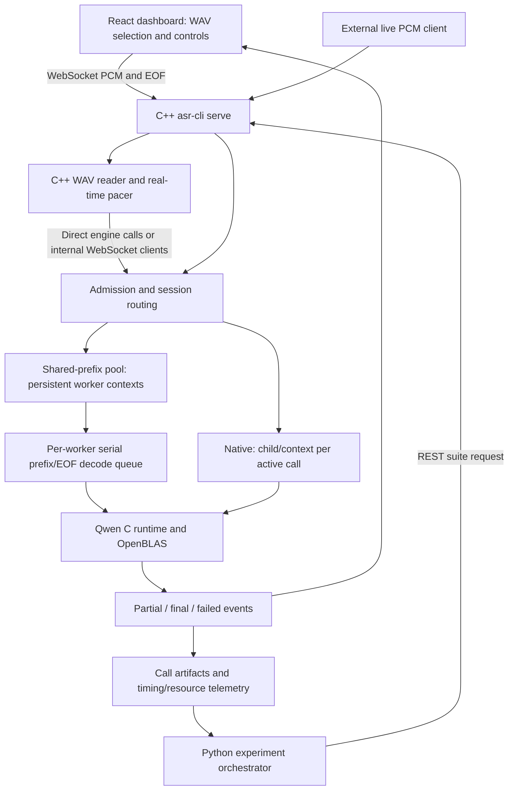
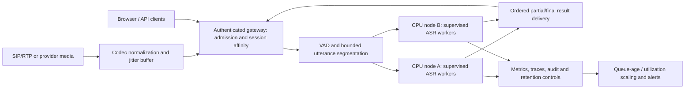

# Historical technical report: shared-prefix CPU multilingual ASR prototype

**Current report:** [Resumable streaming final report, full matrix and updated sizing](FINAL_REPORT_RESUMABLE.md). The measurements below describe the previous prefix runtime.

**Assignment:** AIML CPP LEAD ASR Technical Assignment v2, sections 1–13.  
**Evaluation date:** 6 October 2026. **Report basis:** current `dev-clean` implementation and retained laptop experiments.  
**Status:** runnable prototype and measured short-call evaluation; partial capacity study with unresolved model-decode and network failures. Production capacity and a fully passing end-to-end submission are not claimed.

## 1. Executive summary

The project implements a C++20 service, C CPU inference, a React dashboard and a C++ paced WAV simulator for English, Indonesian and Mandarin. Python orchestrates suites and scores saved transcripts; it does not run inference in the reported experiments. Qwen3-ASR-0.6B is the primary model.

The shared-prefix engine admits multiple independently buffered calls onto one persistent model context. It serializes one four-second preview and a final whole-audio decode per call. This produces text while PCM is arriving, but does not provide independently resumable streaming caches or batched decoding. Four compute threads are configured per worker.

The final direct study contains **900 offered calls, 810 completions and 90 failures** across 27 language/layout points: one worker at total concurrency 1/2/4/8 and two workers at 1/2/4/8/16. Two additional mixed-language WebSocket suites offered 60 calls and completed 42. Warmups are separate.

At one worker / one call, completed-call English WER is **6.52%**, Indonesian WER **4.93%** and Mandarin CER **3.25%**. These accuracy values exclude failed calls. English failed 3/30 runs and Indonesian 6/30, while Mandarin completed 30/30. Failure-inclusive scores are retained separately.

Increasing concurrency improves throughput but creates substantial queueing and delayed finalization. Peak sampled process-tree PSS stayed below 4.37 GiB in the measured study. Adding a second worker did not double English or Indonesian throughput at maximum tested occupancy. The underlying hardware bottleneck was not isolated by profiling.

Collection stopped after the two-worker network suite: a worker became unhealthy with `WebSocket send failed`, and its reported compute-thread settings became zero. Recorded occupancy never exceeded eight sessions per worker. Workers 3–8 and the planned sustained test were not run. The user requested finalization of the available data.

**Recommendation:** retain the modular prototype and reproducible evidence, investigate reliability failures, and evaluate utterance segmentation plus alternative inference paths before endorsing a production deployment. The 50–1,000-call tables are conditional planning scenarios, not demonstrated capacity or procurement recommendations.

### Evidence and report navigation

- [Main experiment report and raw-data index](../results/capacity_cpu_20261006_curves/report.md)
- [Machine-readable curves](../results/capacity_cpu_20261006_curves/curve.json) and [CSV](../results/capacity_cpu_20261006_curves/curve.csv)
- [Inputs and references](../results/capacity_cpu_20261006_curves/inputs.jsonl), [experiment plan](../results/capacity_cpu_20261006_curves/plan.json), [finalization record](../results/capacity_cpu_20261006_curves/finalization.json), [checksums](../results/capacity_cpu_20261006_curves/checksums.json)
- [Detailed sizing equations](CAPACITY_SIZING.md), [assignment Q&A](ASSIGNMENT_QUESTIONS_AND_ANSWERS.md), [run guide](CLI_QUICKSTART.md), [test guide](TESTING.md)

## 2. Environment, software and provenance

| Item | Configuration / evidence |
|---|---|
| CPU | AMD Ryzen 9 9955HX; 16 physical cores, 32 logical CPUs |
| RAM | 15,870,791,680 bytes, approximately 14.78 GiB **total**, not free RAM |
| Host | Fedora Linux 44 KDE; desktop applications shared the machine |
| Recorded kernel / compiler | Linux `7.2.7-200.fc44.x86_64`; GCC `16.2.1 20260819 (Red Hat 16.2.1-2)` |
| Model | Qwen/Qwen3-ASR-0.6B, pinned revision `5eb144179a02acc5e5ba31e748d22b0cf3e303b0` |
| Weight storage / compute | Official BF16 safetensors; CPU kernels also use FP32 buffers/operations. No integer-quantized model was measured |
| C inference runtime | `antirez/qwen-asr`, commit `924694251d9e0f18e5d86bbd06aa3ab5f870002d` |
| BLAS | OpenBLAS OpenMP package `0.3.29-2.fc43`; CPU build uses OpenBLAS |
| Compute settings | Runtime and BLAS thread settings 4 per worker; no CPU affinity; workers scheduled by the OS |
| Input | 16 kHz, mono signed PCM16; 200 ms transport chunks |
| Prefix / deadlines | 4,000 ms preview, EOF refinement; 45,000 ms decode deadline; 30 s pre-EOF idle timeout; 600 s call timeout; shared input limited to 60 s |
| Dependency pins | yaml-cpp 0.8.0, nlohmann-json 3.11.3; exact identities in [revisions.lock](../third_party/revisions.lock) |
| Build/report environment inspected at report time | CMake 4.3.0, Node 22.23.1, Python 3.14.7; React 19.3.0, TypeScript 7.0.2, Vite 8.3.2, Vitest 5.0.3 in package/lock files |

Kernel/compiler values are retained in per-call `environment.json`; other inspected software versions describe the current report environment and are not a new benchmark. Per-call environment contains a legacy `purpose: native single-call diagnostic` label even for shared-prefix calls; resolved config, engine name, suite mode and saved commands establish what actually ran.

The experiment was run from uncommitted `dev-clean` source. `git_head` alone therefore does not identify the complete evaluated implementation. The bundle includes [source_snapshot.zip](../results/capacity_cpu_20261006_curves/source_snapshot.zip) and its [SHA-256 record](../results/capacity_cpu_20261006_curves/source_snapshot.json), plus model, input, driver and binary hashes. Subsequent accuracy/plot processing did not rerun inference. Current plotting source identity is recorded in figure metadata.

Two earlier guard-interrupted trials remain under `results/capacity_cpu_20261006` and `results/capacity_cpu_20261006_full`; they are diagnostic runs and are excluded from the final curves. Host swap was distinguished from ASR process swap. Resource guards reserved RAM/swap and monitored memory pressure; the final study ended on a worker-contract assertion, not a demonstrated RAM ceiling.

## 3. Model and runtime selection

Qwen3-ASR-0.6B was selected to keep a CPU/C++ prototype feasible on this laptop while retaining the three required languages. Official Qwen documentation lists English, Chinese and Indonesian, offline/streaming inference and Apache-2.0 licensing. Its package currently documents streaming through its vLLM backend; upstream throughput claims are not evidence for this laptop's C runtime. Timestamp support in that toolkit uses an additional forced aligner. [Official Qwen3-ASR documentation](https://github.com/QwenLM/Qwen3-ASR).

The pinned C implementation allowed a small native deployment with OpenBLAS rather than Python inference frameworks. Model and runtime are separate choices: limitations of the current wrapper do not establish that the Qwen model family universally lacks multiplexing or streaming.

| Configuration | Model / precision / threads | Session ownership | Decoder behavior | Evidence in this report |
|---|---|---|---|---|
| Native `qwen_native` | Same Qwen 0.6B / BF16 weights / 4 | One active call per occupied child/context | Progressive native decode and EOF refinement | Code/preset retained; no retained matched native accuracy/latency study used here |
| Shared, one worker | Same / same / 4 | Up to 8 active call sessions sharing one context | Serialized prefix/final invocations | Measured total concurrency 1/2/4/8 |
| Shared, two workers | Same / same / 4 each | Two contexts; up to 8 sessions each | Decode jobs serialized per worker; workers may execute concurrently | Measured total concurrency 1/2/4/8/16 |

The one-/two-worker layouts constitute a measured process/scheduling configuration comparison. They do **not** establish a best model size, precision or threading strategy. A same-input native/shared comparison or 2-/4-thread experiment would provide stronger controlled evidence; neither is fabricated in this report. The 1.7B variant was not benchmarked.

## 4. POC architecture and implementation



The public engine interface keeps transport, simulation and inference modular. Entry points are `apps/asr_cli/`, `apps/asr_native_worker/` and `apps/asr_prefix_worker/`; libraries are under `src/`. Source mapping is in [Architecture](ARCHITECTURE.md).

For one shared worker, the context lives inside the service process. For two or more workers, persistent helper processes own the contexts. Thus “two workers” means two inference worker processes plus the service process; it does not mean only two processes or two CPU threads exist.

### Design decisions

| Decision | Reason and practical limit |
|---|---|
| WebSocket PCM/result protocol | Browser-compatible bidirectional PCM, acknowledgements, cancellation and transcript events. REST handles configuration, suites and status. TLS/authentication belong in a production gateway |
| Least-active admission | Spread new calls across free worker capacity before sharing; preserve call-to-worker affinity |
| Per-call state isolation | Call identity, language, PCM, sequences, revisions and deadlines remain independent |
| One decode job per worker | Protect mutable model context; active sessions can share it without concurrent access to the same decoder |
| Oldest-ready previews; bounded EOF bypass | At most two previews bypass a waiting EOF; then service the oldest EOF to limit finalization starvation |
| One four-second preview | Reduce repeated prefix recomputation; deliberately trades continuous revisions for lower repeated work |
| Persistent model lifecycle | Load before warm suites; amortize context startup across calls |
| Bounded admission and queues | Reject excess work / surface failures rather than silently discard PCM |
| Cooperative decode deadline | Generated build sources check cancellation/deadline at token boundaries; vendor checkout stays pristine. A stalled kernel is not preempted by this check |

No batched inference, per-call resumable native cache scheduling, distributed routing or automatic worker respawn is implemented.

## 5. Audio streaming and production media assumptions

One independently streamed source is one call leg. Baseline media is 16 kHz mono PCM16. The browser accepts that baseline; the C++ WAV preparation path can normalize supported formats according to config. A 200 ms chunk contains 3,200 samples / 6,400 PCM bytes. Chunk size is transport granularity, not a promise of 200 ms recognition latency.

The C++ simulator releases samples against monotonic absolute availability deadlines at approximately real-time pace. Backpressure is bounded by configured chunk/time/byte queues and lag limits. WebSocket sequence acknowledgements, sample watermarks and explicit EOF validate delivery. Stop cancels a call; reset creates fresh state. Partial snapshots are provisional until a final event.

The shared decoder invokes offline prefix and whole-audio inference inside that streaming transport. It is not a one-shot time-zero upload, but neither is it full incremental decoding of every arriving chunk. Native mode has different progressive semantics. The Python driver starts services and submits suites; C++ performs WAV reading, PCM pacing, WebSocket simulation and inference.

| Production condition | Current behavior | Proposed evolution |
|---|---|---|
| Telephony audio | WAV/browser/external PCM contract | SIP/RTP or provider gateway; codec decode, resample/mix with explicit channel policy, one stream per leg |
| Silence / end of utterance | Silence submitted; explicit EOF only | Evaluated VAD with pre-roll/hangover, bounded utterances and EOF per segment; measure missed speech and false endpoints |
| Long speech / conversation | Shared input limited to 60 s | Segment/reassemble utterances with IDs, overlap policy and deduplication; bounded buffers |
| Interruptions | Explicit cancellation and new call state | Preserve meaningful completed segments; cancel/revise provisional segment with documented semantics |
| Jitter / loss | Ordered chunks, pacing/lag bounds; no RTP jitter buffer | Timestamp-based jitter buffer, late/lost-packet policy and discontinuity telemetry; never hide dropped audio |
| Worker failure | Assigned calls fail; no automatic replay | Supervisor restart, health routing and bounded replay; deduplicate transcript events |

## 6. Dataset and measurement methodology

Ten **distinct** FLEURS validation WAVs were selected per language from `en_us`, `id_id` and `cmn_hans_cn` using retained manifests, references, source identities and hashes. This is a small read-speech validation cohort, not representative contact-center audio or an official held-out test-set score. Tuning/validation selection is documented in the dataset manifests; measured inputs are preserved in the bundle.

| Language | Distinct WAVs | Minimum duration s | Mean duration s | Maximum duration s |
|---|---:|---:|---:|---:|
| en | 10 | 3.84 | 8.18 | 11.76 |
| id | 10 | 6.96 | 10.54 | 15.48 |
| zh | 10 | 4.98 | 11.46 | 19.34 |

Each direct point repeats the same ten-file language cohort three times. When target concurrency is 16, each repetition replays the complete ten-file cohort twice (20 calls), giving 60 runs per language. This keeps equal file weighting. Repetitions increase runtime observations but do not turn ten unique files into 30 independent audio examples.

One- and two-worker services were warmed separately. The mixed-language network suite at each worker count uses 30 calls (ten per language) and one pass. The load generator replenishes completed calls to maintain target concurrency while inputs remain; target concurrency is not continuous achieved occupancy or a realistic Poisson telephony arrival process. Runtime snapshots retain achieved occupancy and decode queues.

### Timing and resource definitions

| Measure | Timestamp boundary / population |
|---|---|
| First usable text | Stream start → first nonempty partial **or final**; completed-call summaries |
| First partial | Stream start → first nonempty partial; missing if no partial |
| Final result | Stream start → final publication |
| EOF/finalization | Worker EOF receipt → final publication; **not** first-text → last-text |
| Preview / EOF queue delay | Decode job ready → decode start |
| Offline invocation RTF | Sum of prefix and EOF invocation wall time / unique input duration; excludes pacing and ready-job wait |
| Effective RTF | Stream start → final publication, divided by input duration; includes pacing, queueing and finalization |
| Throughput | Completed audio seconds / full measured suite wall seconds, including time spent on failed calls |
| Process-tree CPU equivalents | Sum of process CPU time / elapsed time, including all their threads and service/simulator overhead; 1 equivalent = 100% of one logical CPU |
| Host CPU % | Whole-machine sampled utilization across all logical CPUs; includes unrelated desktop activity |
| Memory | Sampled process-tree PSS (shared physical pages apportioned), RSS and host available RAM; RSS can double-count mapped weights |

Events use monotonic timestamps. Server publication is the controller's receipt before synchronous artifact append; it excludes browser rendering. Per-call raw timing fields are nanoseconds; `curve.json` timing distributions bearing `_ns` names are explicitly labelled **ms** after conversion. Tables/figures convert those distributions to seconds. RTF is dimensionless. Stable-word timing and vendor internal active-compute RTF remain unavailable rather than being reported as zero.

Latency percentiles use type-7 linear interpolation. P50/P95/P99 are descriptive with these small samples; no production tail guarantee or confidence interval is claimed. Languages are kept separate. Completed-call timings exclude failed calls, which biases latency toward survivors; failure counts remain adjacent.

### Accuracy policy

Primary WER/CER includes **completed calls only**, as requested. Completion means a successful final protocol result, not passing an accuracy threshold. The score is corpus-weighted:

```text
WER or CER = (total substitutions + deletions + insertions) / total reference units
```

English and Indonesian use words; Mandarin uses Unicode characters after normalization. All text uses NFC; EN/ID casefold, punctuation becomes word separators and whitespace collapses. Mandarin punctuation/whitespace is removed. Numerals are not semantically rewritten. The policy is `m0_nfc_casefold_punctuation_v1` with retained edit alignments; optional JiWER parity tests are available.

Failure-inclusive scores use an empty hypothesis for each failed call and remain supplementary. Failed audio is not assumed corrupt and is not removed from the offered-call denominator. Excluding difficult failures can improve completed-only quality, so accuracy and reliability must always be read together.

## 7. Single-call baseline, accuracy and model-load behavior

### One worker / total concurrency one

| Language | Complete | First text mean / p50 / p95 / p99 s | EOF mean / p50 / p95 / p99 s | Completed WER/CER % | Failure-inclusive % |
|---|---:|---|---|---:|---:|
| en | 27/30 | 4.93 / 4.89 / 5.23 / 5.27 | 1.47 / 1.44 / 2.29 / 2.37 | 6.52 | 16.10 |
| id | 24/30 | 5.01 / 4.97 / 5.34 / 5.48 | 2.06 / 1.88 / 3.23 / 3.92 | 4.93 | 24.58 |
| zh | 30/30 | 4.65 / 4.62 / 4.89 / 4.91 | 1.47 / 1.36 / 2.34 / 2.40 | 3.25 | 3.25 |
| Language | Offline invocation RTF mean / p95 | Effective RTF mean / p95 | Completed audio / wall time | CPU mean equivalents | Peak PSS GiB |
|---|---|---|---:|---:|---:|
| en | 0.30 / 0.41 | 1.19 / 1.23 | 0.500 | 1.96 | 2.90 |
| id | 0.30 / 0.40 | 1.20 / 1.25 | 0.388 | 2.28 | 2.95 |
| zh | 0.20 / 0.35 | 1.13 / 1.18 | 0.886 | 0.74 | 2.97 |

For example, English throughput of 0.500 audio s/wall s is **not** an RTF of 0.50. Its completed-call effective RTF is approximately 1.19 because paced delivery and EOF refinement are included. The completed-call offline invocation RTF is approximately 0.30. Low completed-only invocation RTF does not offset repeated failed decodes, queueing or slow final publication.

### Model load and cold-start limitations

The saved warmup metadata reports context-load times of 0.189 s for one worker and 0.183 / 0.196 s for the two-worker contexts. They are initialization metadata reused for calls, not per-call startup costs. Mapped weights can load quickly while physical page faults and first inference occur later. These values do not prove cold-storage-to-ready startup latency.

Context loading, idle observations and warmups were separated from measured direct phases. Loaded idle PSS was approximately 1.73 GiB for one worker and 2.76 GiB for two; active inference peaked around 3.0 / 4.4 GiB. A repeated truly cold, cache-controlled startup distribution was not collected. Cold plans and startup logs are retained but should not be presented as that missing experiment.

## 8. Concurrency curves and configuration comparison

### Full direct measurements

CPU figures below are average logical CPU equivalents, not numbers of worker processes or dedicated physical cores. One worker has four compute threads; two workers have eight total. Additional coordination/network threads exist. Operating-system scheduling can move them across cores.

### EN

| Workers | Total concurrency | Complete | First text mean / p95 s | EOF mean / p95 s | Audio s / wall s | CPU mean | Peak PSS GiB | Completed WER/CER % |
|---:|---:|---:|---|---|---:|---:|---:|---:|
| 1 | 1 | 27/30 | 4.93 / 5.23 | 1.47 / 2.29 | 0.500 | 1.96 | 2.90 | 6.52 |
| 1 | 2 | 27/30 | 5.01 / 6.02 | 6.72 / 46.09 | 0.730 | 2.81 | 2.97 | 6.52 |
| 1 | 4 | 27/30 | 5.61 / 7.64 | 17.20 / 47.11 | 0.961 | 3.67 | 2.97 | 6.52 |
| 1 | 8 | 27/30 | 10.71 / 19.90 | 15.60 / 54.28 | 1.049 | 3.83 | 2.99 | 6.52 |
| 2 | 1 | 27/30 | 4.92 / 5.18 | 1.41 / 2.23 | 0.502 | 2.05 | 4.08 | 6.52 |
| 2 | 2 | 27/30 | 5.38 / 5.88 | 2.50 / 3.89 | 0.882 | 4.05 | 4.35 | 6.52 |
| 2 | 4 | 27/30 | 5.70 / 7.22 | 7.72 / 46.05 | 1.024 | 4.59 | 4.36 | 6.52 |
| 2 | 8 | 27/30 | 11.11 / 40.95 | 11.36 / 46.26 | 1.142 | 5.03 | 4.35 | 6.52 |
| 2 | 16 | 54/60 | 15.12 / 29.46 | 19.60 / 73.58 | 1.333 | 5.67 | 4.37 | 6.52 |

### ID

| Workers | Total concurrency | Complete | First text mean / p95 s | EOF mean / p95 s | Audio s / wall s | CPU mean | Peak PSS GiB | Completed WER/CER % |
|---:|---:|---:|---|---|---:|---:|---:|---:|
| 1 | 1 | 24/30 | 5.01 / 5.34 | 2.06 / 3.23 | 0.388 | 2.28 | 2.95 | 4.93 |
| 1 | 2 | 24/30 | 5.07 / 6.02 | 7.64 / 46.79 | 0.544 | 3.12 | 2.97 | 4.93 |
| 1 | 4 | 24/30 | 6.21 / 7.71 | 14.35 / 47.44 | 0.663 | 3.76 | 2.98 | 4.93 |
| 1 | 8 | 24/30 | 8.21 / 13.82 | 23.23 / 54.51 | 0.706 | 3.94 | 2.99 | 4.93 |
| 2 | 1 | 24/30 | 4.95 / 5.18 | 1.92 / 2.97 | 0.390 | 2.36 | 4.34 | 4.93 |
| 2 | 2 | 24/30 | 5.37 / 5.91 | 2.60 / 5.16 | 0.733 | 4.53 | 4.35 | 4.93 |
| 2 | 4 | 24/30 | 6.19 / 7.75 | 7.11 / 38.44 | 0.884 | 5.70 | 4.36 | 4.93 |
| 2 | 8 | 24/30 | 8.57 / 15.53 | 14.66 / 53.06 | 0.995 | 6.28 | 4.36 | 4.93 |
| 2 | 16 | 48/60 | 15.21 / 29.60 | 25.92 / 67.56 | 1.045 | 6.46 | 4.36 | 4.93 |

### ZH

| Workers | Total concurrency | Complete | First text mean / p95 s | EOF mean / p95 s | Audio s / wall s | CPU mean | Peak PSS GiB | Completed WER/CER % |
|---:|---:|---:|---|---|---:|---:|---:|---:|
| 1 | 1 | 30/30 | 4.65 / 4.89 | 1.47 / 2.34 | 0.886 | 0.74 | 2.97 | 3.25 |
| 1 | 2 | 30/30 | 4.70 / 5.07 | 1.59 / 2.34 | 1.661 | 1.28 | 2.97 | 3.25 |
| 1 | 4 | 30/30 | 5.20 / 6.50 | 1.94 / 2.82 | 3.240 | 2.34 | 2.98 | 3.25 |
| 1 | 8 | 30/30 | 6.59 / 9.72 | 2.80 / 4.58 | 4.797 | 3.31 | 2.99 | 3.25 |
| 2 | 1 | 30/30 | 4.65 / 4.91 | 1.50 / 2.52 | 0.884 | 0.83 | 4.35 | 3.25 |
| 2 | 2 | 30/30 | 4.74 / 5.04 | 1.58 / 2.43 | 1.660 | 1.48 | 4.36 | 3.25 |
| 2 | 4 | 30/30 | 5.01 / 5.84 | 1.93 / 2.77 | 3.291 | 3.04 | 4.34 | 3.25 |
| 2 | 8 | 30/30 | 6.37 / 8.61 | 2.53 / 3.81 | 5.011 | 4.78 | 4.35 | 3.25 |
| 2 | 16 | 60/60 | 9.01 / 17.26 | 8.09 / 12.36 | 6.610 | 6.89 | 3.72 | 3.25 |

### Resource distribution examples

The following percentiles are computed from existing approximately 200 ms suite samples, across all offered-call processing, including failures. They are percentiles of sampled utilization, not per-call CPU latency. CPU means in the preceding tables are time-weighted; percentile samples below are equally weighted. Whole-host utilization includes other programs.

| Language | Workers / concurrency | Process-tree CPU p50 / p95 / p99 equivalents | Host CPU mean / p95 / p99 % |
|---|---|---|---|
| en | 1 / 1 | 0.18 / 4.19 / 4.31 | 7.95 / 16.21 / 19.39 |
| en | 1 / 8 | 4.07 / 4.26 / 4.35 | 13.64 / 16.02 / 16.94 |
| en | 2 / 16 | 4.40 / 8.32 / 8.56 | 19.79 / 29.14 / 32.61 |
| id | 1 / 1 | 3.88 / 4.22 / 4.34 | 8.55 / 15.65 / 17.33 |
| id | 1 / 8 | 4.07 / 4.25 / 4.35 | 13.83 / 15.43 / 16.87 |
| id | 2 / 16 | 7.85 / 8.37 / 8.57 | 22.65 / 30.31 / 33.29 |
| zh | 1 / 1 | 0.09 / 4.14 / 4.39 | 3.60 / 14.48 / 15.32 |
| zh | 1 / 8 | 4.01 / 4.42 / 4.52 | 12.05 / 16.11 / 17.18 |
| zh | 2 / 16 | 7.88 / 8.46 / 8.71 | 24.12 / 29.62 / 30.94 |

### Figures and how to read them

Blue is one worker; orange is two workers. The x-axis is target **total concurrent calls**, not workers or per-worker occupancy. Circle markers are measured points; connecting lines illustrate trends, not additional measurements. Timing solid lines show completed-call means; dashed lines show completed-call p95. Dashed lines are neither failed calls nor timeout thresholds.

Accuracy plots use completed-only WER/CER. Failure plots use all offered calls. First-text/EOF/invocation-RTF plots use completed calls. Throughput divides completed audio by total measured wall time, so failures affect it. CPU/memory plots cover full processing, including failed calls. “Text before EOF” uses completed calls as its denominator. Peak PSS is a sampled maximum, not an allocation contract.


PNG and PDF exports plus plotting metadata are retained in the bundle's `figures/` directory.

## 9. Failure analysis, queues and saturation limits

### Direct decode failures

English `27/30` means nine distinct WAVs completed three repetitions and one WAV failed all three: `fleurs_en_us_validation_1518_26`. It produced initial text, then EOF invocation hit the 45 s deadline (45.047 / 45.031 / 45.058 s at concurrency one), with `prefix decode interrupted at token boundary`. No final was published. It failed at low concurrency too, so overload alone does not explain it.

Indonesian failed recordings were `fleurs_id_id_validation_1510_256` and `fleurs_id_id_validation_1549_131`, each repeated. Across the direct points, completion proportions remained EN 90%, ID 80% and ZH 100%. All saved direct per-call checks passed; reported measurement failures were zero. Every baseline-comparable completed transcript matched a completed one-worker/concurrency-one final exactly.

The timeout establishes interrupted decoding, not the reason decoding ran long. Corrupt audio, an infinite hallucination loop, tokenizer/model incompatibility or a vendor bug has **not** been established from these artifacts. Failed inputs remain in the evidence and failure denominator. A cooperative token-boundary deadline is not a hard process kill and does not guarantee preemption of a stalled kernel.

### WebSocket results

| Workers | Target concurrency | Complete | Failed | Decode interruption | Peer disconnected / timed out | Send failed |
|---:|---:|---:|---:|---:|---:|---:|
| 1 | 8 | 23/30 | 7 | 1 | 6 | 0 |
| 2 | 16 | 19/30 | 11 | 2 | 4 | 5 |

### Network outcomes by language

| Workers | Language | Complete | Completed WER/CER % | First text mean / p95 s | EOF mean / p95 s |
|---:|---|---:|---:|---|---|
| 1 | en | 9/10 | 6.52 | 14.28 / 39.83 | 25.12 / 50.84 |
| 1 | id | 7/10 | 5.47 | 7.79 / 14.96 | 21.12 / 49.62 |
| 1 | zh | 7/10 | 3.61 | 6.54 / 9.99 | 21.86 / 49.57 |
| 2 | en | 7/10 | 5.11 | 17.92 / 52.43 | 16.85 / 49.37 |
| 2 | id | 6/10 | 6.25 | 12.44 / 20.48 | 21.93 / 54.34 |
| 2 | zh | 6/10 | 4.66 | 9.05 / 14.90 | 14.90 / 22.18 |

Six one-worker and nine two-worker network calls also failed the saved terminal-event check (`one_final`): the check expects one final for a completion or one failed event for a failure. These transport-failed calls did not satisfy that event contract. They are not hidden by `measurement_failures=0`; that separate counter is not proof of all protocol checks passing.

In the two-worker network snapshots, a worker became unhealthy with `WebSocket send failed` and then reported runtime/BLAS thread counts zero. The driver assertion combined slot and thread conditions, producing the ambiguous message `worker/thread/slot contract changed`. Peak recorded sessions remained eight per worker. The failed assertion therefore does not show admission beyond the eight-slot limit. The job's 19/30 result was recovered from saved artifacts after the assertion, without rerunning inference; it remains a failed reliability/contract observation.

The original collection `status.json` remains FAILED; `finalization.json` marks only a finalized partial study. One worker's direct/network suites finished; two workers' direct suites finished and the network job ended with the failure above. No 3–8-worker points or planned 15-minute sustained run were measured. The study did not reach a confirmed host CPU/RAM saturation ceiling.

### Interpretation

Higher occupancy raises successful-audio throughput while worsening queue/finalization tails. At maximum tested per-worker occupancy, a second worker increases EN throughput from 1.049 to 1.333 (about 27%) and ID from 0.706 to 1.045 (about 48%). These compare eight versus sixteen total calls, with different offered cohorts per repetition; they are not an isolated fixed-workload CPU scaling experiment.

Memory growth is compatible with shared weight pages and duplicated context/buffer state. Two points do not establish a constant incremental memory-per-call slope. CPU average equivalents increase with workers/calls; maxima can exceed compute-thread counts due to service work and sampling. No physical-core pinning or hardware-counter profiling was performed. Memory bandwidth, cache contention and decoder scheduling are plausible contributors, not confirmed exclusive causes.

There is no chosen latency pass/fail target. Consequently, this report gives observed curves rather than “maximum usable calls.” On this cohort, completed invocation RTF is often below one while end-to-end effective RTF exceeds one and some calls fail. That does not establish stable real-time telephony capacity.

## 10. Conditional capacity sizing: 50–1,000 call legs

Full derivation and sensitivity cases are in [CAPACITY_SIZING.md](CAPACITY_SIZING.md). Session slots and processing demand must both fit:

```text
W = max(ceil(N / (k × u)), ceil(N × d / (q × e × u)))
H = ceil(W / w)
Configured compute threads = 4 × W
```

`N` = concurrent legs; `k` = slots/worker; `u` = planned utilization ceiling; `d` = submitted audio seconds per call-second; `q` = completed audio seconds per worker-second; `e` = retained scaling efficiency; `w` = workers/node; `H` = nodes.

Illustrative assumptions: `k=8`, `u=0.70` (30% headroom), `d=1`, `q=0.50` (rounded below measured ID two-worker goodput/2), `e=0.80` (unmeasured contention allowance), `w=2`. **The finite-test goodput proxy is not validated sustained service capacity.** The model therefore gives a sensitivity/planning scenario, not a proven real-time queue-stability result.

For comparable-performance nodes, CPU provision per node is at least `ceil((4w+1)/0.70)` logical CPU equivalents, rounded to 16. The extra one equivalent is an assumed service allowance. Memory envelope is `(1.6 + 1.5w + 0.016 × sessions + 2)/0.70` GiB, rounded to 16 GiB/node. Shared/per-worker constants are an approximate two-layout fit; the per-session and OS reserves are assumptions, not measured allocations. Weight sharing is local to each host. Thread reservations, actual CPU consumption, cloud vCPUs and physical cores are not interchangeable.

| Concurrent legs | Conditional workers | Total logical CPU / vCPU equivalents | Total RAM GiB | 16-CPU / 16-GiB nodes | Target RTF | Target p95 latency |
|---:|---:|---:|---:|---:|---|---|
| 50 | 179 | 1,440 | 1,440 | 90 | Sustained compute <1, unverified | No target selected; not predicted |
| 100 | 358 | 2,864 | 2,864 | 179 | Sustained compute <1, unverified | No target selected; not predicted |
| 200 | 715 | 5,728 | 5,728 | 358 | Sustained compute <1, unverified | No target selected; not predicted |
| 500 | 1786 | 14,288 | 14,288 | 893 | Sustained compute <1, unverified | No target selected; not predicted |
| 1000 | 3572 | 28,576 | 28,576 | 1,786 | Sustained compute <1, unverified | No target selected; not predicted |

These deliberately conservative numbers are **not a procurement recommendation**. Replicating workers cannot cure deterministic decode deadlines or transport errors. This report does not multiply observed average CPU usage by call count and call that a production estimate.

For a future validated VAD pipeline with `d=0.10` and unchanged `q`, the same formula gives 18/36/72/179/358 workers, or 9/18/36/90/179 nodes for 50/100/200/500/1,000 legs. That is a hypothetical sensitivity case, not current functionality or an assumed contact-center speech ratio. Current code sends silence too; use `d=1` until a pipeline actually avoids ASR work and its goodput is remeasured. Bursts and changed utterance lengths can invalidate the average-demand approximation.

For a known language mix and validated comparable sustained rates, replace processing demand with `ceil(N × sum(fraction[l] × d[l] / q[l]) / (e × u))`. No batching speedup is credited. CPU model, NUMA placement, SMT, shared caches, memory bandwidth and network/gateway overhead require measurement on target nodes. Two workers/node deliberately avoids extrapolating to an unmeasured dense host layout.

Recommend 30% planning headroom, bounded decode/input queues and early admission rejection, then validate that margin under burst and failure conditions. Above capacity, queue age and p95 rise, deadlines expire and calls fail. Neither p95 nor a safe session occupancy can be derived from average RTF alone. Costs may be estimated as `node_count × node_hourly_price × operating_hours`, plus network/storage/operations; no current market price is asserted.

## 11. Production architecture and operational design

The following is **proposed**, not implemented cluster functionality:



| Area | Production policy |
|---|---|
| Load balancing | Admit by healthy worker capacity, queue age and language capability; retain session affinity rather than moving live context between nodes |
| Lifecycle / draining | Preload and warm pinned model; readiness only after successful checks; reject new sessions while draining existing calls |
| Recovery | External supervisor for crashed/stalled workers; fail affected calls explicitly; bounded audio replay only under a documented deduplication policy |
| Backpressure | Bound input bytes, call duration, job count and oldest queue age; reject before overload; expose pacing lag and dropped/late-chunk counters |
| Timeout strategy | Distinguish media idle, decode deadline, total call and transport timeouts; coordinate them so queueing does not silently kill healthy calls |
| Observability | Per-language completed accuracy and failures; first/final/EOF p50/p95/p99, queue age, CPU, PSS/RSS, load times, restarts and transport failures |
| Security / privacy | TLS termination, identity/tenant authorization, PCM/artifact size limits, restricted file access, audio/transcript retention, encrypted storage and auditable access |
| Model management | Pinned artifacts/licenses, staged rollout, same-input regression, rollback; no automatic unverified weight download in the serving process |

The POC has fixed local pools and lifecycle/status controls but no production TLS/authentication, autoscaler, SIP gateway, durable recovery or distributed admission. Regulated-environment compliance has not been assessed.

## 12. Alternatives and independent recommendation

This is a **sourced design comparison, not a local performance benchmark**. Source capabilities were checked on 6 October 2026; current upstream support must not be confused with the pinned code evaluated above.

| Candidate | Model/language coverage | Streaming / CPU / quantization | Quality and operational trade-off |
|---|---|---|---|
| Qwen3-ASR-0.6B, current C path | Required EN/ID/ZH; 0.6B model | CPU/BF16; native and shared-prefix wrappers | Measured here; shared-prefix lacks independent streaming caches, stable words and batching; decode/network failures remain |
| Multilingual Whisper base/small through whisper.cpp | Base 74M or small 244M; choose multilingual weights, not `.en` | C/C++, CPU-only execution, integer quantization and separate VAD support | All-language comparison candidate; local accuracy, memory and latency remain unmeasured |
| Streaming bilingual Zipformer through sherpa-onnx | Named bilingual checkpoint covers EN/ZH; does **not** cover Indonesian | Streaming transducer with C/C++/ONNX deployment; checkpoint-specific int8 options | Candidate for EN/ZH routing; keep a separate ID-capable recognizer; multi-model rollout/maintenance adds complexity |

Whisper model/code licensing is MIT; its published model-size table and language-specific quality discussion support base/small as a comparison, not a CPU speed claim. Language tokens include Chinese and Indonesian. [Whisper model documentation](https://github.com/openai/whisper), [language tokenizer](https://github.com/openai/whisper/blob/main/whisper/tokenizer.py).

The whisper.cpp project documents CPU inference, integer quantization and VAD requiring its own model, under MIT. Its microphone example repeatedly transcribes captured windows; that example is not proof of independently cached streaming sessions or sub-second latency. Timestamp behavior and vocabulary prompting should be measured on domain audio. [whisper.cpp](https://github.com/ggml-org/whisper.cpp), [stream example](https://github.com/ggml-org/whisper.cpp/tree/master/examples/stream).

sherpa-onnx provides C/C++ deployment under Apache-2.0. The named bilingual Zipformer supports Chinese/English; the model's own license must be checked separately from the runtime. The documented package includes float/int8 choices and streaming endpoint examples. Hotwords use supported transducers and modified beam search, which changes compute demand. Timestamp quality is checkpoint/decoder dependent and needs validation. These features motivate a routing experiment, not an Indonesian-capable replacement claim. [Runtime/model list](https://github.com/k2-fsa/sherpa-onnx), [Zipformer model documentation](https://k2-fsa.github.io/sherpa/onnx/pretrained_models/online-transducer/zipformer-transducer-models.html), [hotword documentation](https://k2-fsa.github.io/sherpa/onnx/hotwords/index.html).

### Qwen through a different runtime

Current llama.cpp multimodal documentation explicitly lists Qwen3-ASR-0.6B/1.7B GGUF models. This makes it a relevant Qwen runtime experiment; it is **not a second ASR model family**. The listing alone does not establish efficient per-call streaming-cache scheduling, exact converter/model compatibility, quantized accuracy or multi-call latency. Those must be tested on this cohort before claiming a gain. [llama.cpp multimodal documentation](https://github.com/ggml-org/llama.cpp/blob/master/docs/multimodal.md).

### Recommended next experiments

1. Resolve/reproduce current decode and transport failures; inspect failed inputs and generation behavior without silently extending the deadline to hide the failure.
2. Compare native/shared Qwen on the same ten-file cohorts at equal worker/concurrency settings; then a controlled two-/four-thread comparison. Keep accuracy, failures and queueing separate.
3. Benchmark multilingual Whisper base/small through whisper.cpp on the same inputs, with a documented streaming/window policy and optional VAD; no performance benefit is presumed.
4. For strict early text, evaluate streaming Zipformer for EN/ZH and an ID-capable route. Compare endpoint misses, domain words and timestamps as well as CPU cost.
5. Evaluate Qwen GGUF via a pinned llama.cpp build after verifying conversion and audio prompting; measure quantization and per-session state behavior rather than assuming them.

For strict sub-second partials at hundreds of calls, the current four-second preview has an unavoidable minimum availability delay and cannot satisfy that target. Shorter media chunks alone will not change it. A production design needs evaluated incremental recognition, per-session state, bounded scheduling, endpoint policies and hardware measurements. Any batching must bound wait time; quantization gains remain hypotheses until quality and latency are measured. No single unbenchmarked replacement is declared optimal.

## 13. Reproduction, demo and regression evidence

### Setup and ordinary operation

```bash
# Missing pinned sources/models are acquired; C++ and frontend are built.
python3 scripts/setup.py --frontend --with-data

# Four different input calls can be selected through an explicit manifest.
build/release-cpu/asr-cli load --config configs/qwen_prefix_shared.yaml \
  --manifest datasets/manifests/demo_calls.jsonl \
  --calls 4 --concurrency 4 --mode network \
  --set workers.processes=2 --set workers.max_sessions_per_process=2

# Start the service; launch the dashboard in a separate terminal.
build/release-cpu/asr-cli serve --config configs/qwen_prefix_shared.yaml \
  --set workers.processes=2 --set workers.max_sessions_per_process=2 --port 8080
cd frontend
npm run dev
```

The last two commands run from the project root and `frontend/` respectively. Open the dashboard at `http://127.0.0.1:5173` and set service origin `http://127.0.0.1:8080`. Upload baseline PCM WAVs and observe partial/final/failed states. `load --mode network` owns its internal server and does not require a separately started `serve`; REST network suites likewise run C++ simulation internally. External live clients connect to `/v1/asr` themselves rather than through the Python matrix driver.

### Exact capacity collection command used

```bash
python3 tools/testing/run_shared_pool_matrix.py --stress \
  --output results/capacity_cpu_20261006_curves \
  --per-language 10 --repetitions 3 --max-workers 8 --soak-seconds 900
```

This records the requested plan, **not its successful completion**. Actual measured scope is sections 8–9. The output directory must be new for a new experiment. Exact selected inputs, per-worker commands, resolved configs and requests are saved; do not rerun the full command merely to regenerate charts.

```bash
# Recompute tables from saved calls only; then export figures.
python3 tools/testing/run_shared_pool_matrix.py --stress --report-only \
  --output results/capacity_cpu_20261006_curves
MPLCONFIGDIR=/tmp/asr-matplotlib .venv-report/bin/python \
  tools/testing/plot_capacity.py results/capacity_cpu_20261006_curves
```

Report-only regenerates the generic experiment report; manually finalized interruption notes in that report must be preserved/reapplied. This curated final report is a separate document and is not overwritten by that command. Hashes must be updated after artifact changes.

### Demo and regression status

A subsequent focused UI verification is now retained in [ui-controls-20261006/demo.json](../results/ui-controls-20261006/demo.json), with English/Indonesian/Mandarin screenshots in that directory. It used the main shared-prefix C++ service with two workers/two slots each, 100 ms browser chunks and a selected 2 s preview. All three calls completed, displayed first-text/EOF arrival timings and reference-based WER/CER, and generated no browser errors. Preview events consumed 32,000 samples, verifying that the override reached the worker. This short-input integration demo excludes the three known timeout recordings from its selection; it does not replace the unbiased failure accounting or 4 s preview capacity curves above. Browser scores were checked against the Python evaluator.

Existing fast C++/Python/frontend checks were exercised during development. However, the retained aggregate [regression record](../results/regression_20261006T111148_159166Z/regression.json) is FAIL after setup because the default test Python was missing. It does not establish a complete passing regression. Available test coverage includes 19 C++ checks, Python scoring/guard/input checks, frontend unit checks and browser workflows; mocks verify integration rather than model quality.

To create a fresh fast aggregate record using the prepared environment:

```bash
python3 scripts/regression.py --skip-setup --python .venv-reference/bin/python
```

Full regression additionally runs paced audio, real-model browser/service checks and the shared matrix. It is available, but was not run as part of creating this report. A full-model failure must remain visible; no run is labelled passing without its saved result. Setup from an entirely clean offline machine and a sustained model run were not validated here.

## 14. Assignment coverage and remaining laptop work

| Requirement | Current evidence / status | Remaining action or limitation |
|---|---|---|
| CPU/C++ Qwen and three languages | Implemented and measured | Small FLEURS cohort; not domain quality |
| WAV UI, pacing, partial/final, controls | Implemented; direct/network artifacts and subsequent three-language UI demo | Demo is focused integration evidence, not a capacity run |
| At least two sensible configurations | Measured one-/two-worker and session occupancy curves | Native/shared or thread sweep would strengthen runtime selection |
| Latency, RTF, CPU, memory, accuracy | Saved raw values, tables, percentile examples and plots | Stable words / internal active compute unavailable; survivor bias documented |
| Cold vs warm behavior | Load metadata, idle baseline and warmups separated | True cache-controlled cold-start distribution missing |
| Concurrency and saturation | Up to two workers / sixteen total active target calls | Study ended on network fault; maximum hardware / usable capacity not established |
| Sizing 50–1,000 legs | Equations, assumptions and conditional node tables | Fleet counts, sustained RTF and p95 unvalidated |
| Production architecture/design | Diagram and policies above | Telephony/VAD/long calls/security/distributed recovery proposed |
| At least two alternatives | Sourced Whisper and Zipformer/runtime comparison | No local alternative-model performance benchmark |
| Regression and reproducibility | Source snapshot, pins, inputs, hashes, commands | Aggregate passing regression still needs a saved run |
| Demo and submission package | Code/run guides/report/figures/sizing plus current UI screenshots/metrics | Complete aggregate regression and remaining evidence checks before submission |

A practical finishing sequence on this laptop is: (1) investigate the two reliability failures with targeted reproductions, (2) retain the newly saved three-language UI demo, (3) complete a controlled same-input runtime/thread comparison if time allows, (4) record fast/full regression outcomes, and (5) run one modest, bounded sustained network test after reliability fixes. None of these results is invented by documenting the plan.

The assignment allows well-supported negative findings and qualified extrapolation. It does not require the laptop to execute 1,000 calls or a production telephony cluster. Remaining evidence gaps can be disclosed at submission; this report addresses their status and proposed resolution without presenting them as achieved.

## 15. Conclusion

The prototype demonstrates CPU multilingual Qwen integration, paced C++ media delivery and active-session sharing with per-call isolation. Its measured resource/latency curves and failure artifacts are reproducible. Completed-call quality is encouraging for these ten-file language cohorts, while deadline and network failures prevent a reliability or production-capacity claim.

The strongest current conclusion is a trade-off: sharing persistent contexts reduces duplication across active sessions, but serial decoding and growing queues limit responsiveness. Extra slots do not create compute capacity, and extra workers do not resolve intrinsic failed decodes. A bounded utterance pipeline, verified recovery and controlled runtime/model comparisons are the next evidence needed for defensible production sizing.

## 16. Subsequent implementation: resumable shared streaming

The opt-in `qwen_stream` mode now retains independent call state while borrowing one model weight set per worker. Each scheduled turn processes one native streaming quantum, preserves caches/tokens, then releases the worker for another call. It reuses completed encoder windows and unchanged decoder prefills; current partial windows can still be re-encoded. It is not a strictly incremental encoder or inference batching.

Focused real C++ checks completed four calls sharing one worker and four simultaneous calls across two workers/two slots each. Cache reuse, call identity/sample counts and repeated partials were verified. Interleaved English/Indonesian results matched the separately configured native streaming loop, including an isolated cancellation check. Real browser EN/ID/ZH calls showed six to eight revisions with no browser errors.

The fast preset uses early emission and no full-audio final refinement. Matched four-recording pilot results show shorter EOF delays but variable first-text and accuracy results; Indonesian and Mandarin errors were higher on the tested files. Optional refinement restored the tested Indonesian final WER from 16.67% to 8.33%, with 3.42 seconds of added decode work. This is not a general quality/performance guarantee.

See [RESUMABLE_STREAMING.md](RESUMABLE_STREAMING.md) for commands, design, paired tables, settings, screenshots and raw evidence. The original 900-call prefix curves and conditional fleet coefficients are preserved as a different-mode study; no full new capacity curve or production scaling claim is made. New implementation is on `resumable-streaming`, with uncommitted source changes at report time.

## Appendix A. Per-WAV accuracy in five selected setups

These tables use completed calls only. Failed recordings remain visible, and workers/total-call notation matches the new resumable comparison.


Same five setups as the resumable per-WAV tables. Headers mean **workers / total concurrent calls**. Values are arithmetic mean WER (EN/ID) or CER (ZH), in percent, over completed repetitions of each WAV. The first four columns offer three observations per WAV; the last offers six. Failed cells show **Failed (completed/offered)** rather than treating an absent final transcript as a measured transcription. Completion counts and supplementary failure-inclusive scores are retained in the CSV/JSON.

Per-file means are not an unweighted replacement for corpus WER/CER. The original prefix policy used a four-second preview and whole-audio EOF refinement; these results describe that historical policy, not the new resumable runtime.

### EN: mean WER (%) per WAV

| WAV recording ID | 1 worker(s) / 1 call(s) | 1 worker(s) / 2 call(s) | 2 worker(s) / 2 call(s) | 2 worker(s) / 4 call(s) | 2 worker(s) / 16 call(s) |
|---|---:|---:|---:|---:|---:|
| fleurs_en_us_validation_1523_142 | 5.26 | 5.26 | 5.26 | 5.26 | 5.26 |
| fleurs_en_us_validation_1626_141 | 15.15 | 15.15 | 15.15 | 15.15 | 15.15 |
| fleurs_en_us_validation_1654_60 | 0.00 | 0.00 | 0.00 | 0.00 | 0.00 |
| fleurs_en_us_validation_1607_28 | 0.00 | 0.00 | 0.00 | 0.00 | 0.00 |
| fleurs_en_us_validation_1521_51 | 0.00 | 0.00 | 0.00 | 0.00 | 0.00 |
| fleurs_en_us_validation_1518_26 | Failed (0/3) | Failed (0/3) | Failed (0/3) | Failed (0/3) | Failed (0/6) |
| fleurs_en_us_validation_1520_42 | 11.54 | 11.54 | 11.54 | 11.54 | 11.54 |
| fleurs_en_us_validation_1549_14 | 0.00 | 0.00 | 0.00 | 0.00 | 0.00 |
| fleurs_en_us_validation_1510_2 | 9.52 | 9.52 | 9.52 | 9.52 | 9.52 |
| fleurs_en_us_validation_1581_159 | 7.14 | 7.14 | 7.14 | 7.14 | 7.14 |

### ID: mean WER (%) per WAV

| WAV recording ID | 1 worker(s) / 1 call(s) | 1 worker(s) / 2 call(s) | 2 worker(s) / 2 call(s) | 2 worker(s) / 4 call(s) | 2 worker(s) / 16 call(s) |
|---|---:|---:|---:|---:|---:|
| fleurs_id_id_validation_1523_32 | 0.00 | 0.00 | 0.00 | 0.00 | 0.00 |
| fleurs_id_id_validation_1626_67 | 17.86 | 17.86 | 17.86 | 17.86 | 17.86 |
| fleurs_id_id_validation_1654_84 | 0.00 | 0.00 | 0.00 | 0.00 | 0.00 |
| fleurs_id_id_validation_1607_141 | 0.00 | 0.00 | 0.00 | 0.00 | 0.00 |
| fleurs_id_id_validation_1521_214 | 0.00 | 0.00 | 0.00 | 0.00 | 0.00 |
| fleurs_id_id_validation_1518_37 | 0.00 | 0.00 | 0.00 | 0.00 | 0.00 |
| fleurs_id_id_validation_1520_4 | 8.33 | 8.33 | 8.33 | 8.33 | 8.33 |
| fleurs_id_id_validation_1549_131 | Failed (0/3) | Failed (0/3) | Failed (0/3) | Failed (0/3) | Failed (0/6) |
| fleurs_id_id_validation_1510_256 | Failed (0/3) | Failed (0/3) | Failed (0/3) | Failed (0/3) | Failed (0/6) |
| fleurs_id_id_validation_1581_36 | 0.00 | 0.00 | 0.00 | 0.00 | 0.00 |

### ZH: mean CER (%) per WAV

| WAV recording ID | 1 worker(s) / 1 call(s) | 1 worker(s) / 2 call(s) | 2 worker(s) / 2 call(s) | 2 worker(s) / 4 call(s) | 2 worker(s) / 16 call(s) |
|---|---:|---:|---:|---:|---:|
| fleurs_cmn_hans_cn_validation_1523_8 | 22.58 | 22.58 | 22.58 | 22.58 | 22.58 |
| fleurs_cmn_hans_cn_validation_1626_27 | 1.75 | 1.75 | 1.75 | 1.75 | 1.75 |
| fleurs_cmn_hans_cn_validation_1654_53 | 0.00 | 0.00 | 0.00 | 0.00 | 0.00 |
| fleurs_cmn_hans_cn_validation_1607_137 | 0.00 | 0.00 | 0.00 | 0.00 | 0.00 |
| fleurs_cmn_hans_cn_validation_1521_86 | 4.55 | 4.55 | 4.55 | 4.55 | 4.55 |
| fleurs_cmn_hans_cn_validation_1518_114 | 0.00 | 0.00 | 0.00 | 0.00 | 0.00 |
| fleurs_cmn_hans_cn_validation_1520_32 | 0.00 | 0.00 | 0.00 | 0.00 | 0.00 |
| fleurs_cmn_hans_cn_validation_1549_96 | 2.94 | 2.94 | 2.94 | 2.94 | 2.94 |
| fleurs_cmn_hans_cn_validation_1510_56 | 0.00 | 0.00 | 0.00 | 0.00 | 0.00 |
| fleurs_cmn_hans_cn_validation_1581_2 | 3.85 | 3.85 | 3.85 | 3.85 | 3.85 |

**Selected-layout population:** 486/540 completed observations. Failed calls are excluded from primary per-WAV accuracy; they remain visible in counts and supplementary failure-inclusive values. This is only the five selected layouts, not the whole historical 900-call direct study.

[Per-WAV CSV](../results/capacity_cpu_20261006_curves/per_wav_accuracy.csv) · [Scores, counts and failures in JSON](../results/capacity_cpu_20261006_curves/per_wav_accuracy.json).
