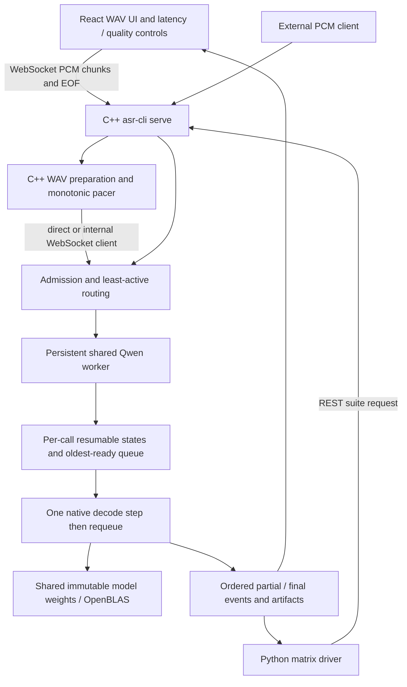
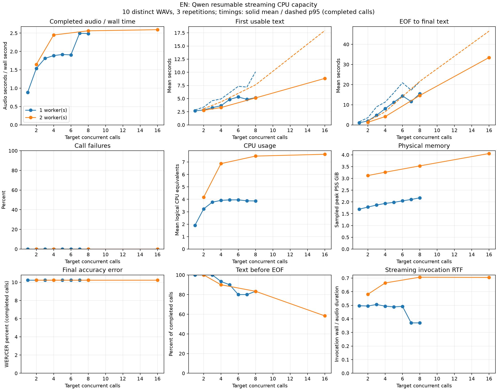
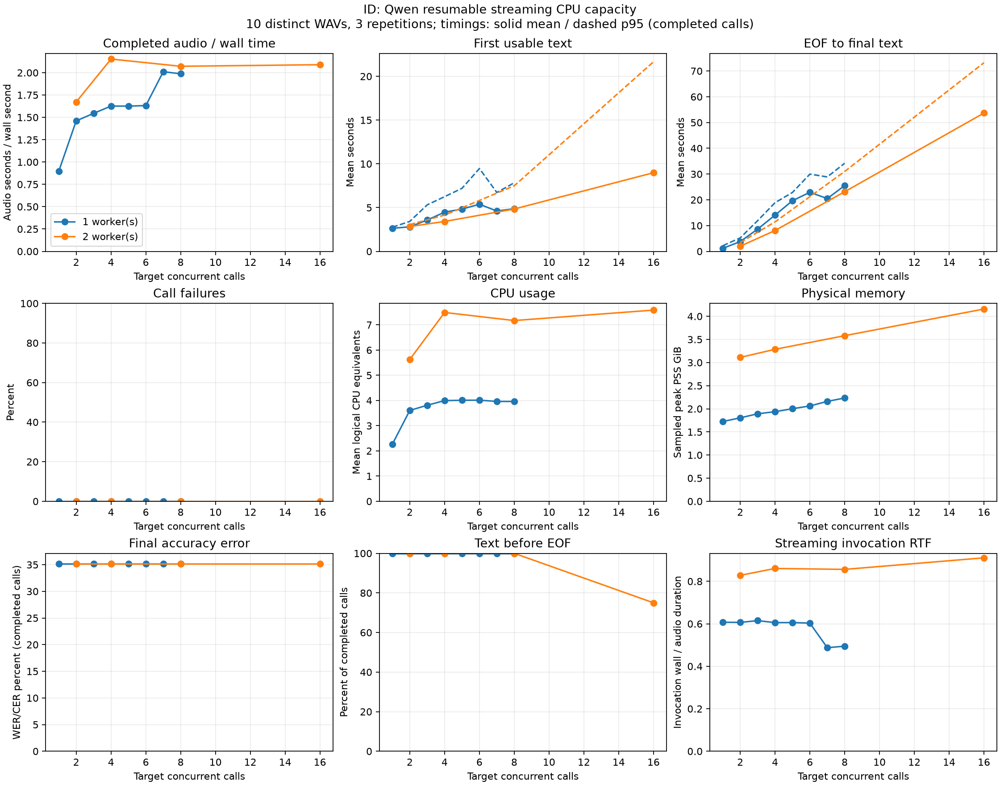
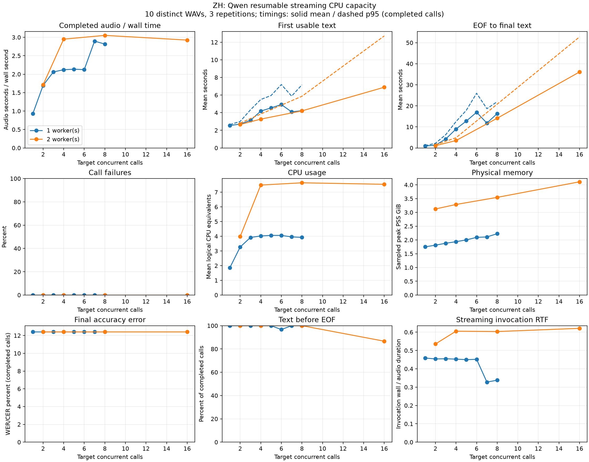
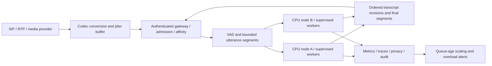

# Archived resumable evaluation draft

**ARCHIVED / SUPERSEDED.** This document is retained as dated development evidence. The only canonical final report is [report.md](../../report.md). Values below must not be presented as the current resumable study.

**Assignment:** AIML CPP LEAD ASR Technical Assignment v2, sections 1–13.  
**Report date:** 7 October 2026. **Primary evidence:** `results/resumable-matrix`, collected across interrupted/resumed runs.  
**Runtime:** Qwen3-ASR-0.6B through the main C/C++ resumable worker path. **Status:** all requested layouts measured; direct tests passed, maximum two-worker WebSocket reliability remains unresolved.

This is the current report. The [previous report](../FINAL_REPORT.md) describes the legacy prefix experiment and remains historical evidence. Its accuracy, throughput and sizing coefficients must not be applied to this runtime.

## 1. Executive summary

The prototype streams paced PCM through a C++20 service to a CPU C inference runtime, then pushes partial and final transcripts to a React UI. Python starts services, submits test requests, scores saved text and generates reports; it performs no ASR inference.

The new runtime shares model weights inside each worker while keeping each call's encoder-window cache, decoder state, token history and text separate. One worker executes one ready streaming step at a time and requeues that call. Completed encoder windows and decoder prefills are reused; a growing partial encoder window can still be recomputed. No tensor batching is implemented.

The study contains **1,170 direct calls, all completed**, over **12 worker/session layouts × three languages**. Sixteen warmup calls are separate. Two mixed-language WebSocket suites offered **60 calls and completed 55**. The five failures occurred at two workers / sixteen total sessions and reported occupied worker slots; they also lacked the expected terminal failure event.

Single-worker, single-call first-text means were **2.678 s EN, 2.638 s ID and 2.546 s ZH**. Final quality was **10.24% English WER, 35.20% Indonesian WER and 12.43% Mandarin CER**. Every direct final transcript matched its same-recording single-call baseline, so increased concurrency did not alter final accuracy on this cohort.

Higher occupancy increased queueing much more than throughput. At two workers / sixteen sessions, first-text p95 reached **17.94/21.67/12.71 s** (EN/ID/ZH; precise values in section 7), and EOF-to-final p95 was **46.56/73.22/52.75 s**. Peak sampled process-tree PSS was **4.157 GiB**. Sixteen admitted sessions are not sixteen continuously sustainable real-time calls.

The runtime is a working streaming POC. Indonesian quality, network admission/failure-event reliability and overloaded response times prevent a production readiness claim. Fleet sizing below is explicitly conditional; no latency pass/fail target was selected.

## 2. Environment, provenance and model selection

| Item | Measured or configured basis |
| --- | --- |
| CPU | AMD Ryzen 9 9955HX; 16 physical cores / 32 logical CPUs |
| RAM | 15,870,791,680 bytes / 14.78 GiB total |
| OS / compiler | Linux kernel 7.2.7-200.fc44.x86_64; GCC 16.2.1 20260819 (per-call environment.json) |
| Model | Qwen3-ASR-0.6B; pinned revision 5eb144179a02acc5e5ba31e748d22b0cf3e303b0 |
| Precision / CPU kernels | BF16 safetensors; FP32 intermediates / OpenBLAS; no measured integer quantization |
| Native runtime | antirez/qwen-asr at 924694251d9e0f18e5d86bbd06aa3ab5f870002d; generated resumable extension |
| Threads | 4 runtime/BLAS compute threads per worker; 8 configured for two workers; no CPU affinity |
| Audio | 16 kHz mono PCM16; 200 ms chunks; approximately real-time pacing |
| Decode settings | 2,000 ms steps; 32 maximum new tokens per step; zero initial chunks withheld; refine_final=false |
| Configuration | configs/qwen_stream_shared.yaml; resolved per-call config.json and per-layout capabilities.json |
| Source provenance | Plan git HEAD 24d34d9f8d6a978521cd4ba7e6b0b524b84363c8; uncommitted implementation, so HEAD alone is insufficient |

Dependency versions are pinned in [revisions.lock](../../third_party/revisions.lock) and [frontend/package.json](../../frontend/package.json): yaml-cpp **0.8.0**, nlohmann-json **3.11.3**, React **19.3.0**, TypeScript **7.0.2**, Vite **8.3.2**, Vitest **5.0.3** and Playwright Core **1.63.0**. The C++ path uses OpenBLAS; the previously inspected host package was **0.3.29-2.fc43**. The historical report records build-tool versions inspected on the same host; these package/configuration identities do not prove a separately captured cold-deployment environment. Model/data identities and per-call kernel/compiler records remain the benchmark provenance.

Qwen 0.6B was selected to make native CPU evaluation practical on this laptop while covering EN/ID/ZH. The primary path remains C/C++; transport and worker interfaces are modular. The model family and inference wrapper are distinct: the previous prefix limitation was not proof that Qwen universally lacks streaming. Official model/language/streaming and Apache-2.0 documentation: [Qwen3-ASR](https://github.com/QwenLM/Qwen3-ASR). The native runtime is MIT; the generated extension retains its notices.

Two sensible measured configurations are one and two workers, with different per-worker session occupancy. This is a process/scheduling comparison using the same model, precision and four-thread budget per worker. Model sizes, integer quantization, alternative models and thread counts were not benchmarked in this matrix.

The [original plan](../../results/resumable-matrix/plan.json) retains its initial sixteen-layout request. The [effective curve plan](../../results/resumable-matrix/curve.json) records the reduced twelve-layout grid. [Resume history](../../results/resumable-matrix/resume_history) preserves earlier statuses, plans, driver identities and interrupted attempts. Completed layouts were retained; incomplete layouts were restarted in separate attempt directories and excluded from combined curves to avoid double weighting. Current CLI and worker binary SHA-256 values match the evaluated plan. Inputs, model acquisition identity, configuration and binary hashes are retained; source modifications are represented by a diff hash, not a fully archived original working tree.

Some environment metadata retains the legacy label `purpose: native single-call diagnostic`; engine, config and suite requests identify the actual resumable run. Host applications, clock speeds and thermals were not controlled. The abrupt speed change between one-worker six/seven-session points spans resumed collection and must not be interpreted as a beneficial seven-session algorithm.

## 3. Implemented architecture and design decisions



One worker runs inside the service process. Two workers run in persistent helper processes plus a coordinating service process. Each worker has four compute threads, so two workers do not mean two CPU cores. Local time multiplexing executes calls serially within a worker; the two workers can compute concurrently.

| Decision | Reason / implemented limit |
| --- | --- |
| WebSocket media/results; REST configuration/tests | Browser-compatible bidirectional audio and result delivery; production TLS/auth belongs at a gateway |
| Least-active routing with call affinity | Spread calls before sharing; preserve decoder state on the assigned worker |
| Separate mutable state, shared immutable weights | Isolate language, caches, tokens, PCM and transcript revisions while amortizing model weights |
| Oldest-ready step scheduling | Process one audio quantum, return the worker, requeue calls fairly; expires overdue calls first |
| 2-second decode steps / 200 ms media chunks | Media delivery is finer than recognition cadence; balances work and early text |
| Zero withheld chunks; no final full-audio refinement | Earlier provisional output and bounded EOF work; accuracy trade-off measured separately |
| Persistent contexts / warmup | Avoid reloading model for each call |
| Bounded input and session admission | Maximum 8 slots/worker; shared input limited to 60 seconds; overload is surfaced |
| Cooperative cancellation / deadlines | Guard checks at token boundaries; a blocking native kernel is not forcibly preempted |
| Generated native extension | Vendor checkout remains unchanged; explicit create/step/text/destroy API isolates state lifetime |

Implementation and introduced files: [RESUMABLE_STREAMING.md](../RESUMABLE_STREAMING.md). Main changes are the generated C state API, existing shared engine/pool/IPC factory, new YAML preset, streaming metrics and UI decode-step handling. Automatic worker restart, distributed routing, multi-call batching and strict incremental encoder execution are not implemented.

## 4. Streaming/media behavior

A call leg is one independent audio stream. Baseline input is mono 16 kHz PCM16; supported WAV conversion occurs in the C++ preparation path, with the resampler and input/output formats saved in summary metadata. Each 200 ms chunk is 3,200 samples / 6,400 bytes. Monotonic absolute readiness deadlines enforce paced delivery. Chunk duration does not promise transcript latency at that interval.

PCM is buffered per call; decoding resumes at audio-step boundaries. EOF drains remaining ready steps and publishes a final result without a whole-file refinement in this experiment. Partial snapshots are provisional. Start/stop/reset, language, chunk/decode controls, reference scoring and first-text/EOF arrival display are available in the UI. Server timestamps and browser arrival/render timing are different measurements.

Backpressure uses bounded queues, byte/time limits and lag/deadline handling. There is no hidden policy to drop speech. Production media should enter through SIP/RTP/provider adapters with codec decoding, resampling and one stream per leg. Production VAD needs tested pre-roll/hangover and endpoint behavior; long calls need bounded utterance segmentation with overlap/deduplication. Cancellation handles interruptions, and a timestamped jitter buffer plus explicit late/lost-packet policy should handle network discontinuities. These production components remain proposed.

### 4.1. Jitter, pacing and backpressure decisions

There are three different delays to separate:

1. **Delivery lag / local pacing jitter:** `sent_ns − scheduled_ready_ns` for a chunk. It includes source/controller scheduling and submission delay; it does not isolate network transit time.
2. **Decode queue delay:** a call has enough audio for a decode step, but its worker is still computing for another call. This is usually the large delay under high concurrency.
3. **Network jitter:** variation in packet arrival relative to the sender's media clock. The loopback WebSocket study does not simulate WAN packet loss, delay variation or RTP reordering; no network-jitter tolerance is established.

The C++ simulator uses absolute monotonic chunk readiness times. It preserves the media clock rather than shifting future deadlines after a slow submission, so lag remains visible. Saved resolved settings are **5 ms late tolerance**, **1,000 ms maximum delivery lag**, and queue caps of **8 chunks / 1,000 ms / 32,000 PCM bytes**. All queue caps apply; at 200 ms/chunk the time/byte caps permit about five full chunks, not eight. Exceeding the lag/queue bound fails explicitly instead of silently discarding speech. `late_chunks` is a threshold counter, not proof of packet loss.

The retained measured call summaries contain **six late chunks and zero audio overflows**. Individual timestamp records show nonzero jitter even when the threshold counter is zero. The following distributions pool recorded chunks by language and transport scope; rejected calls with no delivered chunks contribute no chunk samples. Publication delay is controller receipt minus worker production and excludes browser rendering.

| Scope | Language | Recorded chunks | Send lag mean ms | p50 ms | p95 ms | p99 ms | Maximum ms | Publication delay p95 ms |
|---|---|---|---|---|---|---|---|---|
| curve | en | 16146 | 0.108 | 0.090 | 0.279 | 0.471 | 1.648 | 0.458 |
| curve | id | 20709 | 0.106 | 0.090 | 0.247 | 0.453 | 2.717 | 0.463 |
| curve | zh | 22503 | 0.106 | 0.089 | 0.250 | 0.455 | 2.915 | 0.455 |
| network | en | 737 | 0.156 | 0.085 | 0.122 | 0.349 | 21.771 | 41.284 |
| network | id | 1017 | 0.181 | 0.087 | 0.131 | 0.391 | 22.754 | 41.407 |
| network | zh | 1065 | 0.095 | 0.088 | 0.122 | 0.341 | 0.848 | 41.581 |

All delay distributions, including controller queue and submission wall time, are retained in [delivery_delay_distributions.json](../../results/resumable-matrix/delivery_delay_distributions.json). Local delivery jitter and worker queueing should not be conflated: a worker can accumulate tens of seconds of decode backlog while PCM still arrives close to its schedule.

**Proposed production policy:** retain sequence numbers, sample timestamps and call IDs at the media gateway. RTP/provider media needs a bounded jitter buffer with a validated playout allowance; reorder packets within the deadline, detect gaps, and apply a documented codec packet-loss concealment/discontinuity policy. Expose late/lost packets and any inserted silence to telemetry. WebSocket/TCP preserves byte ordering but retransmission can delay subsequent audio; reconnect should create explicit sequence/session recovery semantics. Choose buffer allowance from measured network tails and the latency budget rather than assuming a fixed universal size. WAN impairment, loss/reordering and reconnect tests remain unperformed.

### 4.2. UI and timestamp decisions

The browser displays evolving partial snapshots and a final state, with start/stop/reset and selected language, PCM chunk size, decode step and optional reference transcript. A 200 ms transport chunk changes delivery granularity; the 2-second decode step changes when a model job becomes ready. The stream UI exposes first-text arrival and EOF-to-final arrival; the benchmark tables use server/controller timestamps and exclude browser rendering. Older observer revisions cannot overwrite a newer/final UI transcript. Full text revisions are provisional, not stable word timestamps.

## 5. Dataset, accuracy and measurement definitions

Ten distinct FLEURS validation recordings per language, with references and SHA-256 hashes, were reused at every layout. This is read speech, not contact-center domain audio or an official held-out test-set score. The same ten recordings repeated three times are thirty observations, not thirty unique audio examples.

| Language | Distinct WAVs | Duration minimum / mean / maximum s |
| --- | --- | --- |
| en | 10 | 3.84 / 8.18 / 11.76 |
| id | 10 | 6.96 / 10.54 / 15.48 |
| zh | 10 | 4.98 / 11.46 / 19.34 |

One worker: total concurrency 1–8. Two workers: total concurrency 2/4/8/16, with 1/2/4/8 slots per worker. Each layout runs separate language suites after model warmup. At concurrency sixteen, each ten-file cohort is replayed twice per repetition to fill slots evenly: sixty calls/language. Direct measured calls total 1,170; warmups total sixteen. Mixed WebSocket tests contain thirty calls each at 1×8 and 2×8.

Completed-call accuracy uses corpus edits/reference units. EN/ID WER uses words; ZH CER uses Unicode characters. Policy `m0_nfc_casefold_punctuation_v1`: NFC, EN/ID casefold, punctuation separators and collapsed whitespace; ZH punctuation/whitespace removed; numerals not semantically rewritten. Failures remain in offered counts and supplementary empty-hypothesis accuracy; their exclusion from primary quality can bias scores.

| Metric | Exact interpretation |
| --- | --- |
| First text / first partial | Stream start → first nonempty result / nonempty partial. “Usable” means nonempty in this metric, not semantically correct or stable |
| Final latency | Stream start → final publication |
| EOF delay | Worker EOF receipt → final publication; not first-to-final duration |
| Stream wall / queue | Sum of actual step wall durations / readiness-to-start waiting over the call |
| Streaming invocation RTF | All serialized streaming-step wall time plus optional refinement / unique audio duration; queue waiting excluded |
| Effective RTF | Final publication minus stream start / audio duration; pacing and queueing included |
| Throughput | Completed audio seconds / full measured suite wall time, including failed-call time |
| CPU / memory | Process-tree logical CPU equivalents, whole-host sampled utilization, RSS/PSS and available RAM |
| Percentiles / units | Type-7 interpolation; raw calls in ns, curve _ns distributions labelled ms, report tables in seconds |

Stable-word latency and vendor active-compute RTF are unavailable. Step counts and reused prefill tokens prove progress/cache use, not model quality. Admission/startup is separate from model loading. Finite completion-driven WAV replenishment is not continuous arrivals or a sustained telephony workload. A descriptive p95/p99 from ten unique WAVs is not a production guarantee.

## 6. Single-call baseline and cold/warm behavior

| Language | Complete | First text mean / p50 / p95 / p99 s | EOF mean / p50 / p95 / p99 s | Final mean / p95 s | WER/CER % |
| --- | --- | --- | --- | --- | --- |
| en | 30/30 | 2.678 / 2.658 / 2.821 / 2.829 | 1.033 / 1.017 / 1.556 / 1.591 | 9.211 / 12.387 | 10.24 |
| id | 30/30 | 2.638 / 2.620 / 2.756 / 2.787 | 1.172 / 1.151 / 2.189 / 2.209 | 11.708 / 16.631 | 35.20 |
| zh | 30/30 | 2.546 / 2.533 / 2.643 / 2.646 | 0.892 / 0.909 / 1.076 / 1.087 | 12.351 / 20.236 | 12.43 |

| Language | Stream invocation RTF mean / p95 | Effective RTF mean / p95 | Audio s / wall s | CPU mean equivalents | Peak PSS GiB |
| --- | --- | --- | --- | --- | --- |
| en | 0.496 / 0.603 | 1.137 / 1.198 | 0.885 | 1.915 | 1.692 |
| id | 0.607 / 0.778 | 1.127 / 1.312 | 0.898 | 2.266 | 1.725 |
| zh | 0.459 / 0.507 | 1.089 / 1.158 | 0.926 | 1.864 | 1.749 |

Initial one-worker context-load metadata was **0.344 s**, reused across all its baseline calls. This is initialization metadata; memory-mapped weights, cached pages and first inference affect actual startup. Per-layout cold dry-run plans, idle telemetry and warmup records are retained, but no cache-controlled cold-start distribution was measured. Idle PSS was approximately **1.269–1.271 GiB** for one worker and **2.413 GiB** for two. Measured warm active peaks include per-call state and native scratch, so idle memory alone is insufficient for sizing.

## 7. Full direct concurrency results

Every row completed all offered calls, reported zero measurement failures and passed the saved delivery/event contract checks. Pre-EOF text counts below expose overload that completion alone hides. Accuracy is identical across these direct layouts: EN 10.24% WER, ID 35.20% WER, ZH 12.43% CER. Detailed stream wall/queue/counter and additional timing distributions remain in the [generated report](../../results/resumable-matrix/report.md), [CSV](../../results/resumable-matrix/curve.csv) and [JSON](../../results/resumable-matrix/curve.json).

### EN

| Workers × slots | Total calls active target | Complete | Text before EOF | First mean / p95 s | EOF mean / p95 s | Audio s / wall s | CPU mean / peak equivalents | Peak PSS GiB |
| --- | --- | --- | --- | --- | --- | --- | --- | --- |
| 1 × 1 | 1 | 30/30 | 30/30 | 2.678 / 2.821 | 1.033 / 1.556 | 0.885 | 1.915 / 4.688 | 1.692 |
| 1 × 2 | 2 | 30/30 | 30/30 | 2.830 / 3.384 | 1.971 / 3.558 | 1.537 | 3.230 / 4.657 | 1.783 |
| 1 × 3 | 3 | 30/30 | 30/30 | 3.285 / 4.602 | 4.741 / 8.956 | 1.812 | 3.770 / 4.690 | 1.869 |
| 1 × 4 | 4 | 30/30 | 28/30 | 3.628 / 4.928 | 8.069 / 11.316 | 1.888 | 3.915 / 4.642 | 1.938 |
| 1 × 5 | 5 | 30/30 | 27/30 | 4.834 / 6.108 | 11.225 / 15.955 | 1.918 | 3.951 / 4.749 | 1.982 |
| 1 × 6 | 6 | 30/30 | 24/30 | 5.312 / 7.333 | 14.383 / 20.917 | 1.907 | 3.956 / 4.703 | 2.047 |
| 1 × 7 | 7 | 30/30 | 24/30 | 4.853 / 7.191 | 11.589 / 17.259 | 2.497 | 3.877 / 4.627 | 2.104 |
| 1 × 8 | 8 | 30/30 | 25/30 | 5.178 / 10.102 | 15.469 / 21.489 | 2.487 | 3.869 / 4.683 | 2.176 |
| 2 × 1 | 2 | 30/30 | 30/30 | 2.765 / 3.061 | 1.282 / 1.966 | 1.647 | 4.164 / 9.240 | 3.122 |
| 2 × 2 | 4 | 30/30 | 27/30 | 3.289 / 4.371 | 4.119 / 6.509 | 2.449 | 6.871 / 9.353 | 3.262 |
| 2 × 4 | 8 | 30/30 | 25/30 | 5.127 / 7.610 | 14.611 / 21.636 | 2.563 | 7.477 / 8.948 | 3.531 |
| 2 × 8 | 16 | 60/60 | 35/60 | 8.835 / 17.935 | 33.447 / 46.556 | 2.594 | 7.622 / 9.230 | 4.056 |



[Standalone PDF](../../results/resumable-matrix/figures/en_capacity.pdf).

### ID

| Workers × slots | Total calls active target | Complete | Text before EOF | First mean / p95 s | EOF mean / p95 s | Audio s / wall s | CPU mean / peak equivalents | Peak PSS GiB |
| --- | --- | --- | --- | --- | --- | --- | --- | --- |
| 1 × 1 | 1 | 30/30 | 30/30 | 2.638 / 2.756 | 1.172 / 2.189 | 0.898 | 2.266 / 4.760 | 1.725 |
| 1 × 2 | 2 | 30/30 | 30/30 | 2.801 / 3.422 | 3.792 / 5.230 | 1.461 | 3.604 / 4.724 | 1.804 |
| 1 × 3 | 3 | 30/30 | 30/30 | 3.575 / 5.312 | 8.637 / 11.912 | 1.545 | 3.811 / 4.851 | 1.892 |
| 1 × 4 | 4 | 30/30 | 30/30 | 4.482 / 6.249 | 14.066 / 18.896 | 1.626 | 3.996 / 4.787 | 1.937 |
| 1 × 5 | 5 | 30/30 | 30/30 | 4.832 / 7.205 | 19.651 / 22.865 | 1.626 | 4.009 / 4.791 | 2.002 |
| 1 × 6 | 6 | 30/30 | 30/30 | 5.382 / 9.465 | 22.924 / 29.975 | 1.632 | 4.012 / 4.815 | 2.061 |
| 1 × 7 | 7 | 30/30 | 30/30 | 4.610 / 6.731 | 20.485 / 28.889 | 2.011 | 3.962 / 4.822 | 2.160 |
| 1 × 8 | 8 | 30/30 | 30/30 | 4.876 / 7.834 | 25.539 / 34.201 | 1.988 | 3.960 / 4.708 | 2.233 |
| 2 × 1 | 2 | 30/30 | 30/30 | 2.838 / 3.060 | 1.994 / 3.427 | 1.672 | 5.626 / 9.323 | 3.111 |
| 2 × 2 | 4 | 30/30 | 30/30 | 3.416 / 4.144 | 8.092 / 11.430 | 2.153 | 7.492 / 9.212 | 3.286 |
| 2 × 4 | 8 | 30/30 | 30/30 | 4.837 / 7.493 | 23.145 / 31.012 | 2.072 | 7.172 / 9.287 | 3.581 |
| 2 × 8 | 16 | 60/60 | 45/60 | 8.988 / 21.665 | 53.679 / 73.217 | 2.089 | 7.586 / 9.374 | 4.157 |



[Standalone PDF](../../results/resumable-matrix/figures/id_capacity.pdf).

### ZH

| Workers × slots | Total calls active target | Complete | Text before EOF | First mean / p95 s | EOF mean / p95 s | Audio s / wall s | CPU mean / peak equivalents | Peak PSS GiB |
| --- | --- | --- | --- | --- | --- | --- | --- | --- |
| 1 × 1 | 1 | 30/30 | 30/30 | 2.546 / 2.643 | 0.892 / 1.076 | 0.926 | 1.864 / 4.890 | 1.749 |
| 1 × 2 | 2 | 30/30 | 30/30 | 2.706 / 3.010 | 1.294 / 2.200 | 1.694 | 3.269 / 4.825 | 1.810 |
| 1 × 3 | 3 | 30/30 | 30/30 | 3.133 / 4.325 | 4.240 / 6.300 | 2.060 | 3.920 / 4.809 | 1.880 |
| 1 × 4 | 4 | 30/30 | 30/30 | 4.182 / 5.499 | 8.977 / 12.514 | 2.121 | 4.021 / 4.891 | 1.935 |
| 1 × 5 | 5 | 30/30 | 30/30 | 4.544 / 5.949 | 12.772 / 17.877 | 2.134 | 4.060 / 4.820 | 2.001 |
| 1 × 6 | 6 | 30/30 | 29/30 | 4.923 / 7.197 | 16.925 / 25.974 | 2.123 | 4.058 / 4.869 | 2.093 |
| 1 × 7 | 7 | 30/30 | 30/30 | 4.090 / 5.881 | 11.803 / 18.650 | 2.895 | 3.960 / 4.733 | 2.109 |
| 1 × 8 | 8 | 30/30 | 30/30 | 4.232 / 7.162 | 16.311 / 21.962 | 2.817 | 3.923 / 4.864 | 2.226 |
| 2 × 1 | 2 | 30/30 | 30/30 | 2.659 / 2.818 | 1.070 / 1.488 | 1.711 | 3.983 / 9.183 | 3.124 |
| 2 × 2 | 4 | 30/30 | 30/30 | 3.270 / 3.851 | 3.503 / 4.843 | 2.949 | 7.487 / 9.401 | 3.287 |
| 2 × 4 | 8 | 30/30 | 30/30 | 4.206 / 5.864 | 14.108 / 20.802 | 3.052 | 7.641 / 9.558 | 3.545 |
| 2 × 8 | 16 | 60/60 | 52/60 | 6.889 / 12.714 | 36.093 / 52.753 | 2.924 | 7.539 / 9.923 | 4.110 |



[Standalone PDF](../../results/resumable-matrix/figures/zh_capacity.pdf).

Solid timing lines are means; dashed lines are p95. Colors distinguish worker counts. These panels show language-separated **direct** suites; the zero failure curves do not include WebSocket failures. Accuracy/latency use completed calls; throughput and process-tree resource measurements include the full phase. Four threads/worker is a configured compute budget, not a hard OS quota: sampled peaks above four/eight include service, pacer, transport and other process threads. CPU equivalents are not process counts.

## 8. Bottlenecks, saturation and deployment interpretation

| Language | Maximum observed direct throughput | Layout | Basis |
| --- | --- | --- | --- |
| en | 2.594 | 2 workers / 16 calls | Finite short-call point; no usable-capacity SLO |
| id | 2.153 | 2 workers / 4 calls | Finite short-call point; no usable-capacity SLO |
| zh | 3.052 | 2 workers / 8 calls | Finite short-call point; no usable-capacity SLO |

One-worker CPU means approach four logical equivalents at moderate occupancy; two-worker means approach seven to eight. This indicates saturation of the configured inference budgets, not saturation of all thirty-two host CPUs. Thread, NUMA and bandwidth bottlenecks were not isolated by profiling.

At equal total concurrency two, two workers/one call each generally reduce EOF delay compared with one worker/two calls, while duplicating worker state and using a larger compute budget. For ID, EOF mean changes from 3.792 to 1.994 s. At total concurrency four, ID changes from 14.066 s (1×4) to 8.092 s (2×2). Adding workers is not free and does not double throughput consistently.

For two workers, ID throughput peaks at four calls (2.153 audio s/wall s), then remains near 2.1 while EOF p95 grows to 73.217 s at sixteen calls. EN throughput grows only slightly from eight to sixteen calls (2.563 → 2.594), while EOF p95 grows from 21.636 → 46.556 s. ZH throughput declines from 3.052 to 2.924. These are clear diminishing returns.

At 2×8, only 35/60 EN, 45/60 ID and 52/60 ZH calls produced any text before EOF. Streaming transport and successful finals therefore do not imply prompt online recognition at maximum occupancy. Step wall RTF can remain below one while effective RTF exceeds four or six because many calls wait for the same serial worker. Extra session slots add admission capacity, not model compute capacity.

For an interactive demonstration, 1×1 or 2×1 provides the lowest observed delays; 2×2 is a measured compromise with more throughput and appreciably longer finalization. This is a selection within the recorded configurations, not a production SLO endorsement. First text itself can be a wrong filler; stable useful-word latency is not measured.

### 8.1. Why this concurrency design was selected

**Sessions and compute slots are different.** A worker has one inference slot but can own several call sessions. Each session retains private language, audio cursor, mutable encoder/decoder buffers, token history, revisions and deadlines. The worker borrows a shared immutable model weight set. With two workers/two sessions each, four live sessions exist but at most two model steps compute simultaneously.

Least-active routing assigns new calls to the healthy worker with fewer admitted sessions, retaining call affinity for cache ownership. Within a resumable worker, every ready step uses the same oldest-ready class; one audio quantum runs, then the call returns behind already-ready calls. Expired calls are retired first. This prevents one long call from monopolizing the entire worker. EOF means drain remaining quanta, not jump straight into a separate whole-file decode in the measured preset. The legacy prefix scheduler's “two previews may bypass EOF” policy is **not** the resumable scheduling policy.

A quantum is not forcibly interrupted halfway through a matrix kernel. Cooperative guard checks occur at decoder token boundaries, so a 2-second audio quantum does not guarantee a 2-second maximum wall-time turn. A slow kernel, dense speech, token work or OS contention can delay other calls. The limit of eight sessions per worker bounds admission/state growth; it is a supported implementation limit, not measured usable real-time capacity. Automatic rescheduling after worker death is unavailable: affected calls fail and the service must be restarted to restore capacity.

Two persistent helper processes were chosen to isolate mutable runtime state and enable parallel worker computation; one worker stays in-process to reduce IPC overhead. Four compute threads each provides a reproducible starting budget, but this study does not establish that four is optimal. Mapped weights may share physical pages between processes on one host, whereas decoder scratch and session caches remain private. Neither mapped-weight sharing nor more session slots implies batching.

The final grid keeps one-worker targets 1–8 and two-worker targets 2/4/8/16. This compares equal total concurrency at 2/4/8, includes a sixteen-call stress endpoint and limits the experiment to the authorized laptop scope. Each language uses the same unique files and balanced cohort replay. The pool was observed at the requested [1..8] and [1,1]/[2,2]/[4,4]/[8,8] occupancy peaks; those finite peaks are not continuous steady occupancy.

**Operational choice from these data:** use low occupancy for an interactive demonstration; scale additional workers/hosts before filling every session slot if queue age or EOF tails become unacceptable. No numerical p95 acceptance target was selected, so this report gives the curve rather than declaring a maximum “usable” call count. Overload protection must account for compute backlog, not only free session slots. Fix network lifecycle admission before production capacity planning.

### 8.2. Why WER/CER increased relative to the prefix study

The fast resumable policy changes the final hypothesis construction: it accumulates 2-second streaming outputs, enables past-text conditioning, allows rollback of the last five tokens and performs no full-audio final correction. Zero initially withheld chunks permits early output from limited audio context. An early wrong word can become retained context and influence later output; future audio can resolve boundaries that were ambiguous at the first step. These are plausible mechanisms supported by code, **not isolated causes proven by this matrix**.

The old prefix mode decoded the full recording at EOF, with more complete acoustic context. Its completed-only accuracy also excluded failed recordings, so old/new survivor populations differ. Different preview/refinement policies and collection conditions prevent a causal runtime-only comparison. The 32-new-token step cap could matter, but truncation has not been demonstrated as the cause. Transport jitter is not shown to explain the quality change.

Concurrency itself did not change direct quality here: all 1,170 direct final transcripts matched the same-recording single-call baseline. The high Indonesian error remains at concurrency one and therefore cannot be blamed on shared-worker contention in this cohort. Completion only means the final protocol succeeded; it is not a quality pass.

A controlled accuracy follow-up would reuse all ten WAVs per language and change only `refine_final`, then only initial withholding/rollback settings where supported, while preserving threads, step size, references and normalization. Count failures and measure the extra EOF cost. One previous ID pilot improved WER from 16.67% to 8.33% with full refinement and added 3.42 s of decode work; that one-recording result is not a general improvement guarantee. **The full matrix in this report was not rerun with final refinement.**

## 9. WebSocket failure analysis and historical comparison

| Network layout | Language | Complete | First mean / p95 s | EOF mean / p95 s | Completed WER/CER % | Failure-inclusive % |
| --- | --- | --- | --- | --- | --- | --- |
| 1 × 8 | en | 10/10 | 6.365 / 8.861 | 21.560 / 30.193 | 10.24 | 10.24 |
| 1 × 8 | id | 10/10 | 5.770 / 7.463 | 23.174 / 29.210 | 35.20 | 35.20 |
| 1 × 8 | zh | 10/10 | 6.087 / 8.580 | 22.583 / 35.621 | 12.43 | 12.43 |
| 2 × 8 | en | 8/10 | 9.119 / 19.514 | 39.170 / 52.640 | 11.59 | 29.27 |
| 2 × 8 | id | 9/10 | 10.200 / 20.636 | 44.701 / 58.184 | 31.29 | 37.43 |
| 2 × 8 | zh | 8/10 | 9.598 / 12.834 | 45.199 / 70.970 | 12.50 | 27.51 |

The 1×8 network suite completed 30/30. The 2×8 suite completed 25/30 (16.67% failures). Every rejected call reported **`all healthy prefix worker slots occupied`**; “prefix” is a legacy internal label in the shared pool, not evidence that the wrong runtime ran. Capabilities identify resumable streaming and actual occupancy reached [8,8]. These are admission failures, not demonstrated WAV corruption, model loading failures or decode watchdog failures.

For those five records, `one_final` was false because the expected terminal failed event was absent. Other saved checks passed. Exact-sample summary metadata alone does not prove a rejected session's audio reached the model. A lifecycle/admission timing race during network replenishment is a plausible explanation, but its root cause is not established by this report. Admission cleanup and explicit terminal failure delivery require a targeted reproduction.

The bundle's status `COMPLETE` means the driver finished the requested grid. It also records five call failures; it is not an all-tests-pass claim. Direct measured calls have no call failures; network checks do not all pass.

Historical prefix results used four-second previews plus whole-file final refinement and had 900 direct calls with 90 failures. Their baseline completed-only quality was EN 6.52% WER, ID 4.93% WER and ZH 3.25% CER, with different survivor populations. The new early-emission/no-refinement mode completes all direct calls and provides repeated progress, but current quality is worse on this small cohort. Different policies, failures and collection conditions prevent an isolated runtime speed or accuracy comparison. A matched native benchmark was not added to this full matrix. Optional final refinement improved one earlier Indonesian pilot, but must be re-evaluated on all ten files and under load before claiming a general remedy.

### 9.1. Completed calls versus the common completed-recording subset

Independent rescoring of raw baseline transcripts confirms both historical and current completed-only values. WAV hashes and references match between the studies. However, “completed calls only” selects different recordings: the old prefix baseline completed nine of ten EN files, while the new resumable baseline completes all ten.

| Language | Distinct recordings completed in both studies | Old prefix score on those recordings | New resumable score on those recordings | New resumable score on all completed recordings |
|---|---|---|---|---|
| en | 9 | 6.52% | 5.98% | 10.24% |
| id | 8 | 4.93% | 30.99% | 35.20% |
| zh | 10 | 3.25% | 12.43% | 12.43% |

Therefore, **approximately 6% English WER is valid for the common nine-recording subset** (new runtime: 33 word edits / 552 reference words across three repetitions = **5.98%**). It is not the full new completed-call score (63 / 615 = **10.24%**).

The additional EN recording, `fleurs_en_us_validation_1518_26`, failed in the old study but now completes. Its new score is **10 edits / 21 reference words = 47.62% WER** per repetition; three repetitions add thirty errors and sixty-three reference words. It accounts for the difference between the subset and full-cohort English scores. Dropping it now would exclude a successfully completed, difficult recording and must be labelled a subset analysis rather than primary completed-only accuracy.

On the common subset, EN improves from 6.52% to 5.98%; ID still increases from 4.93% to 30.99%, and ZH from 3.25% to 12.43%. Thus survivor-population differences explain the English aggregate comparison but do not explain away the ID/ZH quality loss. Different streaming/refinement policies remain relevant; this observational comparison does not isolate their causal contributions.

## 10. Conditional sizing for 50–1,000 call legs

All numbers in this section are **extrapolated planning scenarios**, not measured fleet capacity. No latency acceptance target was selected. Continuous call-shaped queue stability, long-call limits, cold deployments and network reliability remain unvalidated.

```text
W_slots   = ceil(N / (k × u))
W_compute = ceil(N × d / (q × e × u))
W         = max(W_slots, W_compute)
Nodes H   = ceil(W / w)
Configured model compute threads = 4 × W
```

N is call legs, k=8 maximum slots/worker, u=0.70 utilization allowance (30% headroom), d=1 submitted audio second/call-second, q=1.0 provisional completed audio seconds/worker-second, e=0.80 unmeasured deployment-efficiency allowance and w=2 workers/node. q is rounded below the measured two-worker ID goodput/2 (2.089/2=1.045 at maximum occupancy); it is **not validated sustained capacity**. Current code submits silence, so no speech-duty-cycle saving is assumed. The formula gives W=max(ceil(N/5.6),ceil(N/0.56)).

CPU/node allowance: ceil((4w+1)/0.70)=13 comparable logical CPU equivalents, rounded to **16 logical CPUs**. The additional one equivalent is an assumed service allowance. vCPUs, physical cores and measured CPU consumption are not interchangeable; arbitrary cloud CPUs are not necessarily equivalent to this laptop.

Memory/node: measured two-worker idle PSS is 2.413 GiB; active peak at two calls is at most 3.124 GiB; at sixteen calls it is 4.157 GiB. A conservative, cohort-specific envelope is `PSS ≈ 2.42 + 0.72 + 0.08 × max(0,S−2)` GiB for two workers and 2≤S≤16 active short calls. The 0.08 GiB slope rounds above the approximately 0.074 GiB/session difference; this is an inferred envelope, not measured allocation ownership. Add 2 GiB assumed OS/gateway reserve and divide by 0.70: approximately 9 GiB at sixteen calls, rounded to **16 GiB RAM/node**. Shared pages are counted once within a node and replicated across nodes. Long calls require remeasurement and bounded segmentation.

| Call legs | Conditional workers | Estimated logical CPU/vCPU equivalents | RAM GiB | 16-CPU / 16-GiB nodes | Target RTF | Target p95 | Basis |
| --- | --- | --- | --- | --- | --- | --- | --- |
| 50 | 90 | 720 | 720 | 45 | Sustained compute <1; unverified | Not selected / not predicted | q=1, e=.8, u=.7, d=1 |
| 100 | 179 | 1440 | 1440 | 90 | Sustained compute <1; unverified | Not selected / not predicted | q=1, e=.8, u=.7, d=1 |
| 200 | 358 | 2864 | 2864 | 179 | Sustained compute <1; unverified | Not selected / not predicted | q=1, e=.8, u=.7, d=1 |
| 500 | 893 | 7152 | 7152 | 447 | Sustained compute <1; unverified | Not selected / not predicted | q=1, e=.8, u=.7, d=1 |
| 1000 | 1786 | 14288 | 14288 | 893 | Sustained compute <1; unverified | Not selected / not predicted | q=1, e=.8, u=.7, d=1 |

These counts are not a procurement recommendation. For a validated language mix, use `W_compute=ceil(N × sum(fraction[l] × d[l]/q[l])/(e×u))` with comparable sustained rates. A hypothetical VAD duty factor d=0.1 gives 9/18/36/90/179 nodes under unchanged q, but VAD is not implemented and would change input lengths/compute behavior; remeasure q. No batching gain is credited. Use session affinity, NUMA-local allocation and only tested worker density per host; extrapolating eight workers on one node is unsupported.

Cost equation: `cost = H × node_hourly_cost × operating_hours + storage/network/operations`. No currency or hardware price is asserted. Scaling workers cannot fix bad transcripts or missing network failure events. Above capacity, queue age and EOF tails rise, then deadlines/admission fail; p95 cannot be predicted from mean RTF alone. Validate the assumed 30% headroom using bursts, sustained arrivals and worker-loss tests.

## 11. Proposed production architecture



Preload pinned models; mark ready after warm health checks. Balance using healthy free capacity and queue age, keep each call on one worker/node, and drain existing calls before shutdown. Supervise failed workers and use bounded replay with event deduplication rather than silently migrating a live cache. Distinguish idle-media, step-decode, total-call and transport timeouts. Bound PCM, sessions, call duration and queue age; reject overload before unlimited buffering.

Use TLS, authenticated tenant authorization, bounded payloads, restricted file access, encrypted storage, configurable voice/transcript retention and audited access. These are production requirements, not an implemented compliance claim. Observe per-language failures/accuracy, first/EOF/final p50/p95/p99, queue age, dropped/late chunks, CPU, PSS, swaps, load/warm times and restarts. Horizontal admission, telephony gateways, durable recovery, TLS/auth and autoscaling are not implemented in the POC.

## 12. Alternatives and independent recommendation

This is a sourced design comparison checked on 7 October 2026, not local alternative-model benchmark evidence.

| Candidate | Coverage / runtime | Streaming, quantization and practical limitation |
| --- | --- | --- |
| Current Qwen 0.6B C path | EN/ID/ZH; CPU BF16, C/C++ and OpenBLAS | Measured resumable state; no batching, stable words or token timestamps; ID quality needs work |
| Multilingual Whisper base/small via whisper.cpp | C/C++; choose multilingual weights, not .en | CPU inference, integer quantization, VAD model support; windowed stream examples need latency/state evaluation |
| Streaming bilingual Zipformer via sherpa-onnx | Streaming EN/ZH transducer with C/C++ / ONNX deployment | Checkpoint-specific int8 options and endpoint decoding; named bilingual model does not cover Indonesian |

Whisper.cpp documents CPU execution, integer quantization, VAD and MIT licensing. Domain prompts/timestamps, early-output accuracy and window reconciliation need local evaluation; a captured-window example does not prove independent streaming caches. [whisper.cpp documentation](https://github.com/ggml-org/whisper.cpp).

Sherpa's documented bilingual Zipformer models cover EN/ZH and include checkpoint-specific float/int8 packages. Model size, model license, decoder/timestamp/hotword support and maintenance must be checked for the selected checkpoint; the runtime license does not establish every model's license. ID needs a separate suitable route. [Official Zipformer model documentation](https://k2-fsa.github.io/sherpa/onnx/pretrained_models/online-transducer/zipformer-transducer-models.html).

First fix and reproduce WebSocket admission/failure events; then evaluate full-cohort quality with withholding/refinement settings and profile remaining encoder work. Benchmark multilingual Whisper with the same inputs, and a true streaming Zipformer EN/ZH route plus an ID-capable recognizer. Smaller quantized kernels may improve CPU cost but quality must be remeasured; no speedup is assumed. Licensing, checkpoint updates, hotwords and accurate word timestamps matter as well as WER.

For strict sub-second partials at hundreds of calls, this 2-second-step preset has an availability floor exceeding the target. Smaller media chunks alone cannot meet it. Evaluate a recognizer with appropriate incremental state and short steps, bounded scheduling/batching waits, VAD and target-node load tests. Independent per-call state is now implemented, but it does not remove CPU contention or guarantee useful text within a deadline.

## 13. Reproduction, demo and regression

```bash
# Acquire missing pinned assets; prepare data and build the CPU service/UI.
python3 scripts/setup.py --frontend --with-data

# New full matrix; output must be new.
python3 tools/testing/run_shared_pool_matrix.py --resumable-matrix \
  --output results/resumable-matrix-new --per-language 10 --repetitions 3 --figures

# Continue an interrupted matrix; keep identical inference configuration/binaries.
python3 tools/testing/run_shared_pool_matrix.py --resumable-matrix --resume \
  --output results/resumable-matrix --per-language 10 --repetitions 3 --figures

# Regenerate current tables/figures without inference.
python3 tools/testing/run_shared_pool_matrix.py --resumable-matrix --report-only \
  --output results/resumable-matrix --figures

# UI demo server: two workers, two sessions each.
build/release-cpu/asr-cli serve --config configs/qwen_stream_shared.yaml \
  --manifest datasets/manifests/demo_calls.jsonl \
  --set workers.processes=2 --set workers.max_sessions_per_process=2 --port 8081
# Separate terminal: cd frontend && npm run dev
```

Select http://127.0.0.1:8081 in the UI and connect. See [run/implementation guide](../RESUMABLE_STREAMING.md) and [complete testing guide](../TESTING.md). Report-only uses saved transcripts and does not rerun the model. Stop unrelated ASR servers for new measurement runs. The report environment is prepared with `python3 scripts/setup.py --reports`.

The earlier [real UI evidence](../../results/resumable-ui-20261006/demo.json) and language screenshots show six to eight revisions/call and no browser errors. The [state-isolation test](../../results/resumable-comparison/state-isolation.log) verifies alternating EN/ID states against the separately configured native loop, cache reuse and cancellation isolation. The [two-worker focused service check](../../results/resumable-check-2w2s-v2/status.json) passed four simultaneous calls. These pilots supplement the full matrix; they are not an extra ten-file accuracy study or capacity measurement.

Development verification included nineteen C++ CTest checks, frontend unit/build checks and Python guard/scoring tests. Those results are separate from actual inference reliability. No fresh all-in-one full regression was run while preparing this report; the historical failed aggregate regression must not be relabelled as passing. A clean-machine setup, sustained telephony-like load, recovery and production security remain unverified.

## 14. Assignment coverage and remaining gaps

The source assignment's functional, media, model, measurement, sizing, architecture and alternatives requirements were checked against this report. Implemented behavior, measured results, proposed production features and unvalidated extrapolations are separated throughout. A limitation is an explicit finding rather than a claimed completed feature.


| Assignment area | Current answer / evidence | Limit |
| --- | --- | --- |
| §§1–3 CPU Qwen POC / UI | C/C++ CPU Qwen, WAV UI, three languages, evolving partial/final, start/stop/reset and telemetry | No production readiness claim |
| §4 media assumptions | 16 kHz PCM, paced chunks, EOF/cancel, bounded buffering; proposed telephony/VAD/jitter | Long calls limited to 60 s; production VAD/media adapter missing |
| §5 model configurations / cold-warm | One/two workers and occupancy measured; same 0.6B precision; load/idle/warm artifacts | No size/quantization/native matched matrix or cold-cache distribution |
| §6 accuracy and performance | Language tables, timing mean/percentiles, RTF, CPU/RSS/PSS, raw transcripts and graphs | Ten unique files/language; stable useful-word/active compute unavailable |
| §7 concurrency / 50–1000 sizing | 12 layouts; direct 1170/1170; conditional formulas/table and 30% headroom | Network 55/60; no sustained usable capacity or predicted p95 |
| §8 architecture / operations | POC and production diagrams; scheduling, affinity, draining/recovery/backpressure/security proposals | Distributed lifecycle/security/recovery not implemented |
| §9 alternatives | Qwen versus Whisper.cpp and streaming Zipformer/sherpa-onnx | Alternatives locally unmeasured; bilingual checkpoint lacks ID |
| §§10–13 deliverables and conclusions | Source, setup/run/test guides, UI evidence, report/figures/raw data and sizing | Complete passing aggregate regression and long-call domain evidence missing |

## 15. Conclusion

The new runtime demonstrates independently resumable calls sharing model weights in the main CPU C/C++ path. All requested direct layouts completed without transcript changes across concurrency, and the full result set includes queueing, CPU/memory and language quality. The strongest benefit is progressive per-call state reuse and reliable direct completion on this cohort.

The limitations are concrete: Indonesian WER is 35.20%, high occupancy delays first/final text substantially, and maximum two-worker WebSocket replenishment rejects five calls without the expected terminal failure event. No extra worker count, model family, quantization gain or production capacity is invented. Fix network lifecycle reliability and validate accuracy before production selection; use the sizing table only as a qualified planning model.

## Evidence index

- [Effective curves and plan](../../results/resumable-matrix/curve.json), [CSV](../../results/resumable-matrix/curve.csv), [generated report](../../results/resumable-matrix/report.md).
- [Input WAVs/references/hashes](../../results/resumable-matrix/inputs.jsonl), [raw-job index](../../results/resumable-matrix/jobs.json), [driver completion status](../../results/resumable-matrix/status.json), [checksums](../../results/resumable-matrix/checksums.json).
- [Resume/guard history](../../results/resumable-matrix/resume_history), [figure metadata](../../results/resumable-matrix/figures/metadata.json).
- [Implementation and run guide](../RESUMABLE_STREAMING.md), [architecture/code map](../ARCHITECTURE.md), [testing](../TESTING.md).
- [Historical prefix report](../FINAL_REPORT.md), [historical assignment Q&A](../ASSIGNMENT_QUESTIONS_AND_ANSWERS.md); their old measurements/sizing remain mode-specific. Sections 3–5 and 14 above answer the current design/assignment requirements.

## Appendix A. Sampled resource percentiles

CPU statistics below are sample-weighted over measured phases, including pacing and failures. Section 7 uses time-weighted process-tree CPU means. Host utilization includes unrelated programs and is a percentage of all 32 logical CPUs. Samples are temporally correlated; these percentiles are descriptive. All layouts are retained in [resource_percentiles.json](../../results/resumable-matrix/resource_percentiles.json).

| Layout | Language | Process-tree CPU mean / p50 / p95 / p99 equivalents | Whole-host CPU mean / p95 % | PSS mean / p95 / peak GiB |
|---|---|---|---|---|
| 1×1 | en | 1.872 / 0.623 / 4.404 / 4.540 | 6.816 / 14.850 | 1.651 / 1.682 / 1.692 |
| 1×1 | id | 2.223 / 2.486 / 4.413 / 4.570 | 7.857 / 14.881 | 1.685 / 1.712 / 1.725 |
| 1×1 | zh | 1.829 / 0.742 / 4.501 / 4.682 | 6.655 / 15.244 | 1.702 / 1.732 / 1.749 |
| 1×8 | en | 3.870 / 4.122 / 4.448 / 4.534 | 13.398 / 16.557 | 2.032 / 2.151 / 2.176 |
| 1×8 | id | 3.957 / 4.122 / 4.437 / 4.553 | 14.101 / 17.365 | 2.093 / 2.209 / 2.233 |
| 1×8 | zh | 3.919 / 4.143 / 4.543 / 4.661 | 13.769 / 16.949 | 2.090 / 2.180 / 2.226 |
| 2×8 | en | 7.580 / 8.154 / 8.785 / 9.057 | 25.865 / 30.464 | 3.773 / 4.003 / 4.056 |
| 2×8 | id | 7.554 / 8.106 / 8.764 / 9.061 | 25.614 / 30.100 | 3.887 / 4.136 / 4.157 |
| 2×8 | zh | 7.500 / 8.214 / 8.964 / 9.190 | 25.521 / 30.639 | 3.867 / 4.048 / 4.110 |

Across the 1,230 retained measured direct/network call summaries, late_chunks totals 6 and audio_overflows totals 0. These configured counters do not mean zero pacing jitter; nanosecond audio_timing records retain send lag and submission timings. Rejected network calls do not prove successful PCM delivery merely because their prepared-input metadata is present.

## Appendix B. Failed network recording identities

| Recording | Language | Observed outcome |
|---|---|---|
| fleurs_id_id_validation_1518_37 | id | Admission rejected; terminal failure event absent |
| fleurs_cmn_hans_cn_validation_1518_114 | zh | Admission rejected; terminal failure event absent |
| fleurs_en_us_validation_1549_14 | en | Admission rejected; terminal failure event absent |
| fleurs_en_us_validation_1510_2 | en | Admission rejected; terminal failure event absent |
| fleurs_cmn_hans_cn_validation_1581_2 | zh | Admission rejected; terminal failure event absent |

## Appendix C. Assignment questions and concise answers

| Assignment question / decision | Answer and evidence |
|---|---|
| Why Qwen3-ASR and which variant? | Required primary family; 0.6B selected for a feasible CPU/C++ prototype and EN/ID/ZH. Variant/precision superiority is unproven (§2). |
| Is this C++ inference or a Python test? | C++ service/simulator and C model kernels perform recognition. Python only orchestrates, scores and plots (§§1–3,13). |
| Is delivery actually live-like? | Paced 200 ms PCM chunks become available against monotonic deadlines; resumable model steps run during arrival. No one-shot file upload is used for the main test (§4). |
| What media is accepted and how is it normalized? | Baseline 16 kHz mono PCM16; C++ preparation records input/output format and resampler, browser uses baseline PCM (§4). |
| What does the UI show and control? | WAV/language, start/stop/reset/state, provisional/final transcript, chunk/decode controls, first/EOF arrival and reference WER/CER (§4.2, UI evidence). |
| How are jitter, buffering and backpressure handled? | Bounded delivery queue, absolute pacing, 5 ms late flag and 1 s delivery limit; production timestamped jitter buffer/codec loss policy proposed, not WAN-tested (§4.1). |
| How will silence, long speech and interruptions work? | Current explicit EOF/cancel and 60 s cap; proposed validated VAD, bounded utterances, pre-roll/hangover and segment revision/replay policy (§§4,11). |
| How are sessions scheduled and weights shared? | Independent mutable call states share immutable weights; least-active admission, call affinity, one oldest-ready quantum/worker then requeue (§8.1). |
| Why compare one and two workers? | Same model/precision/thread budget per worker isolates process/occupancy trade-offs within available hardware; direct grid 12 layouts and 36 language points (§7). |
| What are cold versus warm costs? | Saved cold plans, load metadata, idle observations and separate warmups; no controlled cold-cache distribution (§6). |
| What are the exact latency/RTF/CPU/memory definitions? | Monotonic server boundaries, completed timing population, streaming wall versus queue/pacing distinction, process-tree CPU equivalents and PSS/RSS (§5, Appendix A). |
| How is quality scored? | Labelled references; corpus EN/ID WER and ZH CER under explicit M0 normalization; failed calls separate and supplemental empty hypotheses (§5). |
| What is the concurrency/saturation result? | Direct 1170/1170; diminishing goodput and growing queues/tails; full 16-call occupancy does not sustain sixteen real-time calls (§§7–8). |
| What errors occurred and was audio dropped? | Five 2×8 WebSocket admission failures with missing expected failure events; zero recorded overflow, six late chunks. Rejected metadata does not prove PCM delivery (§9, Appendices A/B). |
| What is sizing for 50/100/200/500/1000? | Explicit admission/processing/node formulas with language-aware demand, shared-memory envelope, 30% headroom and conditional table; no predicted p95 or validated fleet capacity (§10). |
| How does one host scale to production? | Affine gateway routing, node-local workers/NUMA, warm readiness, draining, supervised recovery, bounded replay and queue-age admission; cluster features proposed (§11). |
| What about security/privacy? | Proposed TLS/auth/tenant isolation, restricted media access, payload limits, encryption, retention and audit; no compliance claim (§11). |
| Are there two alternative ASR families? | Multilingual Whisper via whisper.cpp and streaming Zipformer via sherpa-onnx; bilingual checkpoint requires an ID-capable route. CPU performance/quality locally unmeasured (§12). |
| How would strict sub-second partials at hundreds of calls change the design? | Current 2 s step has an availability floor; evaluate suitable incremental recognizers, short bounded steps, quality-controlled quantization/VAD, bounded batching and target-node tests (§12). |
| Are all deliverables present? | Source/pins, setup/run/test docs, three-language UI evidence, complete data/plots/report, architecture/alternatives and conditional sizing. Passing aggregate full regression, production-shaped soak, alternative benchmarks and security validation remain gaps (§§13–14). |

## Submission conclusion

Submit this report with source/version files, [README](../../README.md), [testing/run guidance](../TESTING.md), the complete `results/resumable-matrix` bundle and the retained resumable UI screenshots/demo JSON. The new direct matrix is complete. The conclusion remains conditional on quality and network reliability: independently resumable CPU calls work, but high occupancy is queued work, Indonesian quality is insufficiently validated, and maximum WebSocket admission/failure delivery still needs correction. No production SLO or compliance certification is asserted.

## Appendix D. Mean accuracy for each WAV across five concurrency setups

Each language table has ten rows, one per distinct WAV. Columns identify **workers / total concurrent calls**, not calls per worker. Thus **2 workers / 16 calls** means eight sessions per worker; **2 workers / 2 calls** means one session per worker. The five selected layouts are a readable subset of the full twelve-layout study.

Cells are the arithmetic mean of that WAV's completed-call WER (EN/ID) or CER (ZH), in percent. The first four setups have **three observations per WAV**; 2 workers / 16 calls has **six observations per WAV**, because full cohorts were replayed twice in each of three repetitions. No failed direct calls are excluded in these selected setups: all completed. Each cell is computed from saved per-call edit/reference-unit scores. The same reference is used in every repetition.

Per-file scores must not be averaged unweighted to replace the main corpus WER/CER: the report's language aggregate weights by reference words/characters. The tables below show which recordings contribute the errors and whether concurrency changes an individual recording's quality.

### EN: per-WAV mean WER (%)

| WAV recording ID | 1 worker / 1 call | 1 worker / 2 calls | 2 workers / 2 calls | 2 workers / 4 calls | 2 workers / 16 calls |
| --- | ---: | ---: | ---: | ---: | ---: |
| fleurs_en_us_validation_1523_142 | 0.00 | 0.00 | 0.00 | 0.00 | 0.00 |
| fleurs_en_us_validation_1626_141 | 15.15 | 15.15 | 15.15 | 15.15 | 15.15 |
| fleurs_en_us_validation_1654_60 | 0.00 | 0.00 | 0.00 | 0.00 | 0.00 |
| fleurs_en_us_validation_1607_28 | 0.00 | 0.00 | 0.00 | 0.00 | 0.00 |
| fleurs_en_us_validation_1521_51 | 0.00 | 0.00 | 0.00 | 0.00 | 0.00 |
| fleurs_en_us_validation_1518_26 | 47.62 | 47.62 | 47.62 | 47.62 | 47.62 |
| fleurs_en_us_validation_1520_42 | 11.54 | 11.54 | 11.54 | 11.54 | 11.54 |
| fleurs_en_us_validation_1549_14 | 0.00 | 0.00 | 0.00 | 0.00 | 0.00 |
| fleurs_en_us_validation_1510_2 | 9.52 | 9.52 | 9.52 | 9.52 | 9.52 |
| fleurs_en_us_validation_1581_159 | 7.14 | 7.14 | 7.14 | 7.14 | 7.14 |

### ID: per-WAV mean WER (%)

| WAV recording ID | 1 worker / 1 call | 1 worker / 2 calls | 2 workers / 2 calls | 2 workers / 4 calls | 2 workers / 16 calls |
| --- | ---: | ---: | ---: | ---: | ---: |
| fleurs_id_id_validation_1523_32 | 72.22 | 72.22 | 72.22 | 72.22 | 72.22 |
| fleurs_id_id_validation_1626_67 | 42.86 | 42.86 | 42.86 | 42.86 | 42.86 |
| fleurs_id_id_validation_1654_84 | 0.00 | 0.00 | 0.00 | 0.00 | 0.00 |
| fleurs_id_id_validation_1607_141 | 30.00 | 30.00 | 30.00 | 30.00 | 30.00 |
| fleurs_id_id_validation_1521_214 | 0.00 | 0.00 | 0.00 | 0.00 | 0.00 |
| fleurs_id_id_validation_1518_37 | 75.00 | 75.00 | 75.00 | 75.00 | 75.00 |
| fleurs_id_id_validation_1520_4 | 16.67 | 16.67 | 16.67 | 16.67 | 16.67 |
| fleurs_id_id_validation_1549_131 | 36.84 | 36.84 | 36.84 | 36.84 | 36.84 |
| fleurs_id_id_validation_1510_256 | 66.67 | 66.67 | 66.67 | 66.67 | 66.67 |
| fleurs_id_id_validation_1581_36 | 0.00 | 0.00 | 0.00 | 0.00 | 0.00 |

### ZH: per-WAV mean CER (%)

| WAV recording ID | 1 worker / 1 call | 1 worker / 2 calls | 2 workers / 2 calls | 2 workers / 4 calls | 2 workers / 16 calls |
| --- | ---: | ---: | ---: | ---: | ---: |
| fleurs_cmn_hans_cn_validation_1523_8 | 22.58 | 22.58 | 22.58 | 22.58 | 22.58 |
| fleurs_cmn_hans_cn_validation_1626_27 | 7.02 | 7.02 | 7.02 | 7.02 | 7.02 |
| fleurs_cmn_hans_cn_validation_1654_53 | 8.82 | 8.82 | 8.82 | 8.82 | 8.82 |
| fleurs_cmn_hans_cn_validation_1607_137 | 5.88 | 5.88 | 5.88 | 5.88 | 5.88 |
| fleurs_cmn_hans_cn_validation_1521_86 | 4.55 | 4.55 | 4.55 | 4.55 | 4.55 |
| fleurs_cmn_hans_cn_validation_1518_114 | 0.00 | 0.00 | 0.00 | 0.00 | 0.00 |
| fleurs_cmn_hans_cn_validation_1520_32 | 28.57 | 28.57 | 28.57 | 28.57 | 28.57 |
| fleurs_cmn_hans_cn_validation_1549_96 | 2.94 | 2.94 | 2.94 | 2.94 | 2.94 |
| fleurs_cmn_hans_cn_validation_1510_56 | 6.90 | 6.90 | 6.90 | 6.90 | 6.90 |
| fleurs_cmn_hans_cn_validation_1581_2 | 26.92 | 26.92 | 26.92 | 26.92 | 26.92 |

**Observed result:** every WAV has the same error score in all five selected setups, including the difficult English recording. Concurrency changed timings and resource use, but did not change these final hypotheses. This is evidence for this fixed configuration and cohort, not a guarantee for other model settings or live-call inputs.

[Per-WAV CSV](../../results/resumable-matrix/per_wav_accuracy.csv) · [Per-WAV means, repetition counts and edit totals](../../results/resumable-matrix/per_wav_accuracy.json).
